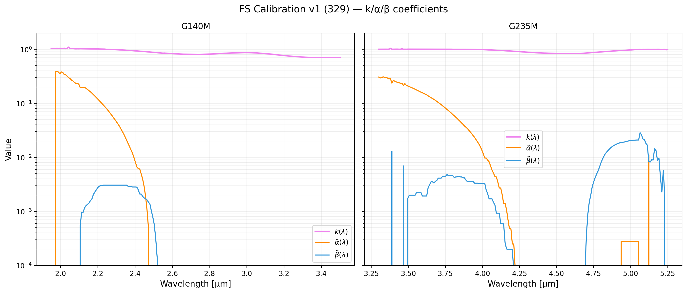
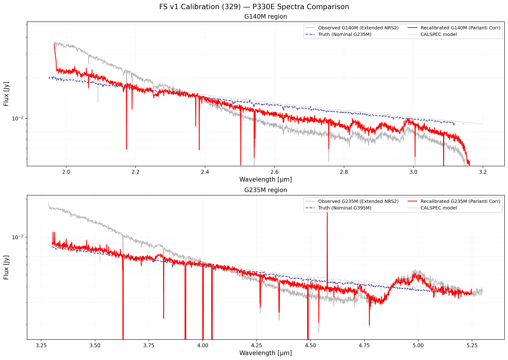
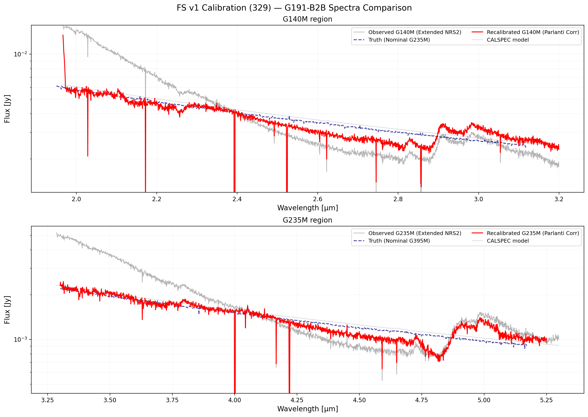
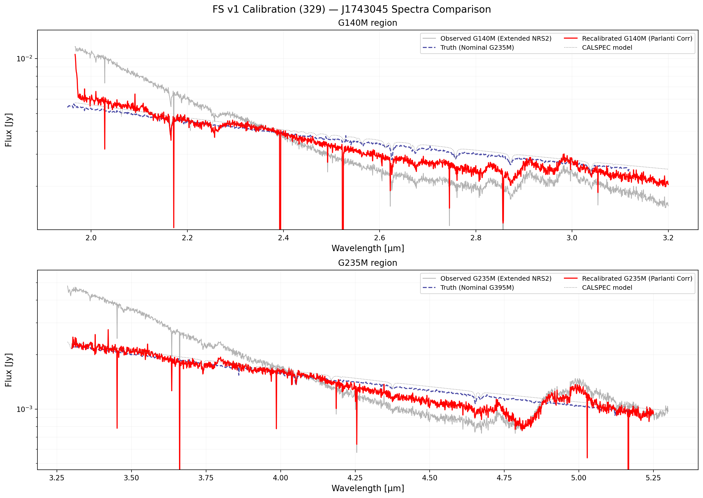

# NIRSpec Wavelength Extension Report — 329 FS v1

**Date:** March 29, 2026  
**Project:** NIRSpec Wavelength Extension Calibration  
**Data Version:** Fixed Slit (FS) v1 coefficients

## Summary of Analysis
This report documents the derivation of calibration coefficients for the NIRSpec fixed-slit (FS) wavelength extension. The analysis uses per-exposure FS NRS2 extractions (Jy) and CALSPEC models as the reference.

Three primary standard stars were used:
- **P330E** (G2V, PID 1538)
- **G191-B2B** (WD, PID 1537)
- **J1743045** (A8III, PID 1536)

The model follows Parlanti et al. (2025) (Equation 1):
$$S_{\text{obs}}(\lambda) = k(\lambda) \cdot f(\lambda) + \tilde{\alpha}(\lambda) \cdot f(\lambda/2) + \tilde{\beta}(\lambda) \cdot f(\lambda/3)$$

### Solver Results
| Grating | $k(\lambda)$ median | $k(\lambda)$ range | $\tilde{\alpha}$ max | $\tilde{\beta}$ max |
|:--------|:-----------|:-----------|:------|:------|
| G140M NRS2 | **0.846** | 0.706–1.093 | 0.390 | 0.003 |
| G235M NRS2 | **0.976** | 0.834–1.041 | 0.308 | 0.029 |

## Calibration Coefficients
The following logarithmic plot showing $k(\lambda)$, $\tilde{\alpha}(\lambda)$, and $\tilde{\beta}(\lambda)$ all on the same log plot mimics the style of Parlanti et al. (2025) Fig 3.

## Source Spectra Comparisons
For each reference source, we compare:
- **Observed (Raw Extended)**: The raw per-exposure NRS2 x1d.
- **Truth (Nominal next-grating)**: MAST Level 3 nominal spectra for overlapping wavelengths.
- **Recalibrated (Parlanti Corr)**: The data corrected for first-order throughput ($k$) and higher-order contamination ($\tilde{\alpha}, \tilde{\beta}$).
- **CALSPEC model**: The intrinsic reference model.

### P330E

### G191-B2B

### J1743045

## Plotting Scripts
The scripts used to generate these plots are located in this directory:
- [plot_fs_v1_coeffs_log.py](plot_fs_v1_coeffs_log.py)
- [plot_fs_v1_source_spectra.py](plot_fs_v1_source_spectra.py)

---
*Created automatically by Antigravity on 2026-03-29.*

### Project Instructions (Original User Request)
- Create a new directory `nirspec_wavext_work/reports/329_fs_v1/`
- Generate a file `REPORT.md`
- Generate new plots based on `@LATEST_WORK.md` and `fs_v1` analysis.
- Log plot (kappa, alpha, beta) mimicking Parlanti Fig 3.
- All spectra on the same plot for each reference source.
- Include plotting scripts in the same directory.
