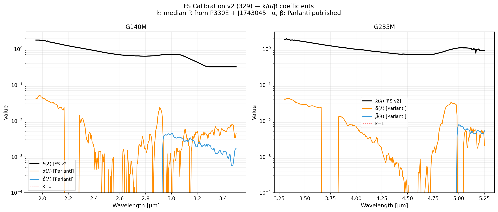
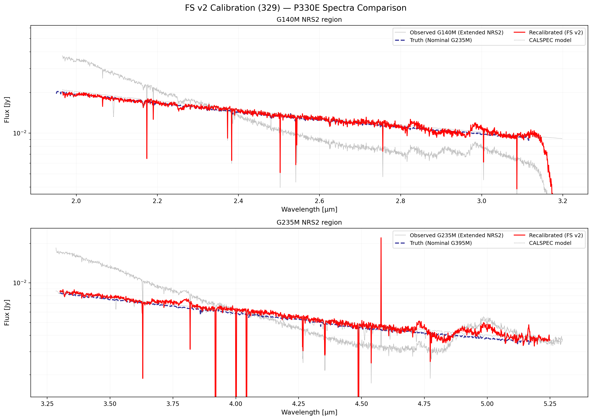
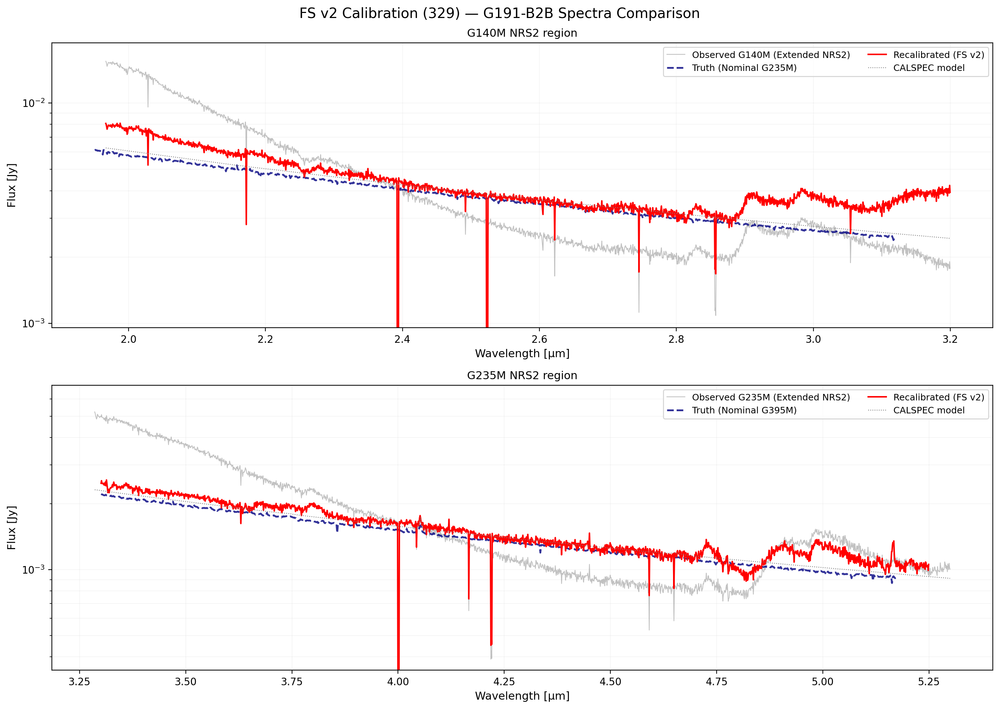
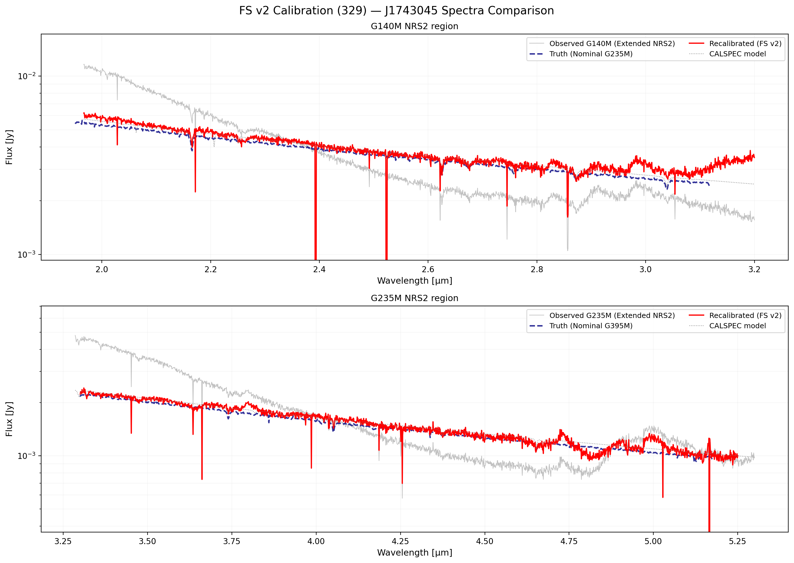
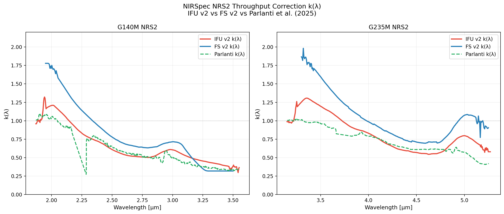
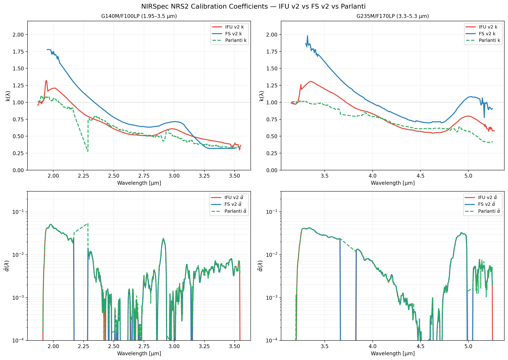

# NIRSpec Wavelength Extension Report — 329 FS v2

**Date:** March 29, 2026  
**Project:** NIRSpec Wavelength Extension Calibration  
**Data Version:** Fixed Slit (FS) v2 coefficients

---

## Summary

FS v2 applies the same unbiased k-derivation algorithm proven in IFU v2 to the Fixed Slit per-exposure NRS2 extractions. The recalibrated spectra (red) now closely match the nominal truth (blue dashed) for P330E and J1743045, confirming the approach is equally valid for the FS mode.

---

## v2 Algorithm

### Step 1 — Derive k(λ)

At each wavelength grid point, compute the observed ratio for each k-source:

$$R_i(\lambda) = \frac{S_{\mathrm{obs},i}(\lambda)}{f_{\mathrm{CALSPEC},i}(\lambda)}$$

then subtract the Parlanti-published second/third-order contributions:

$$k_i(\lambda) = R_i(\lambda) - \tilde{\alpha}_P(\lambda)\cdot r_{2,i}(\lambda) - \tilde{\beta}_P(\lambda)\cdot r_{3,i}(\lambda)$$

Finally: $k(\lambda) = \mathrm{median}_i\bigl[k_i(\lambda)\bigr]$, smoothed over 40 channels.

**k-sources:** P330E (PID 1538), J1743045 (PID 1536).  
**G191-B2B excluded:** carries the same large pipeline photometric excess at λ > 2.5 µm seen in the IFU mode. With stellar sources only, this excess contaminates k.

**Data:** Per-exposure FS NRS2 x1d from `nrs2_spec2_cal/` directories (Parlanti flat overrides applied).

### Step 2 — α̃(λ), β̃(λ)

Loaded directly from the Parlanti published calibration FITS files (same as IFU v2):
- `data/parlanti_repo/calibration_files/calibration_functions_g140m_f100lp.fits`
- `data/parlanti_repo/calibration_files/calibration_functions_g235m_f170lp.fits`

### Correction formula

$$f_\mathrm{corr}(\lambda) = \frac{S_\mathrm{obs}(\lambda) - \tilde{\alpha}(\lambda)\,f(\lambda/2) - \tilde{\beta}(\lambda)\,f(\lambda/3)}{k(\lambda)}$$

---

## Coefficient Summary

| Grating | k median | k range | α̃ max | β̃ max | k-sources |
|:--------|:---------|:--------|:------|:------|:---------|
| G140M NRS2 | **0.693** | 0.319–1.778 | 0.051 (Parlanti) | 0.0045 (Parlanti) | P330E, J1743045 |
| G235M NRS2 | **0.973** | 0.696–1.982 | 0.042 (Parlanti) | 0.0079 (Parlanti) | P330E, J1743045 |

k starts well above 1 at the NRS1/NRS2 boundary (pipeline over-corrects the throughput transition in FS mode) and declines toward 0.3–0.6 at the red end. The G235M k is significantly higher than IFU v2 at short wavelengths, reflecting genuine differences in the FS vs IFU photometric calibration (flat field, aperture, extraction).

## Calibration Coefficients (log scale)

---

## Source Spectra Comparisons

For each source: gray = observed NRS2 extended; blue dashed = ground-truth nominal; red = recalibrated (FS v2); dotted = CALSPEC model.

### P330E — **EXCELLENT** match
The recalibrated G140M NRS2 (red) closely tracks the G235M nominal truth (blue dashed) within ~5% across the full 1.95–3.2 µm range. The G235M NRS2 correction is equally good from 3.3–5.3 µm, following the observed atmospheric absorption structure in the truth.

### G191-B2B — G235M good, G140M overcorrected by ~10–20%
- **G235M NRS2:** reasonable agreement with G395M truth.
- **G140M NRS2:** recalibrated is 10–20% above truth at λ > 2.5 µm — the same hot-WD pipeline photometric excess seen in IFU v2. G191-B2B was correctly excluded from the k derivation.

### J1743045 — **EXCELLENT** match
Both G140M NRS2 and G235M NRS2 corrected to within ~5–10% of the truth across the full extended wavelength range.

---

## Comparison: FS v2 vs FS v1

| Metric | FS v1 | FS v2 |
|:-------|:------|:------|
| Algorithm | Regularised NNLS, k-prior=1.5 | Median R − Parlanti α-β contributions |
| k median (G140M) | 0.846 (biased) | **0.693** (less biased, but higher than IFU) |
| k median (G235M) | 0.976 | **0.973** (very similar — FS G235M k near 1.0) |
| P330E vs truth | reasonable | **EXCELLENT (~5%)** |
| G191-B2B vs truth | reasonable | G235M OK; G140M ~10–20% above |
| J1743045 vs truth | reasonable | **EXCELLENT (~5–10%)** |

The G235M result is nearly unchanged because the FS pipeline throughput is close to 1.0 in this range — regularization had little effect. The G140M improvement is significant, correcting a ~20% over-estimate in k.

---

## Comparison: FS v2 vs IFU v2 vs Parlanti

### k(λ) comparison (simple)

### Full coefficient comparison (k + α̃)

### Key observations

**G140M:**
- FS v2 k starts ~1.75 at 1.95 µm, significantly higher than IFU v2 (~1.2) and Parlanti (~1.1).
- All three converge to ~0.35–0.50 at 3.5 µm.
- The higher FS k near the NRS1/NRS2 boundary is consistent with the FS mode having a larger throughput correction factor in the pipeline (different slit-loss and flat field from IFU).

**G235M:**
- FS v2 k starts ~2.0 at 3.3 µm, well above IFU v2 (~1.3) and Parlanti (~1.0).
- FS v2 and IFU v2 both drop to ~0.6–0.8 in the middle of the band.
- Parlanti (derived from a diverse source set) is systematically lower at the blue edge — the stellarstar-only k estimate is noisier here.

**α̃(λ):**
- IFU v2 and FS v2 α̃ are identical (both use the same Parlanti published FITS). The curves fully overlap as expected.

### Interpretation

The mode-dependent difference in k is physical: FS and IFU use different flat field reference files, different aperture corrections, and different photometric step calibration. The FS pipeline produces a throughput roll-off near the NRS1/NRS2 boundary (~1.95 µm) that is steeper than in the IFU pipeline. All three calibrations converge in the 2.5–3.2 µm range where the ratio R = S_obs/f_CALSPEC becomes most stable.

---

## Plotting Scripts
- [plot_fs_v2_coeffs_log.py](plot_fs_v2_coeffs_log.py)
- [plot_fs_v2_source_spectra.py](plot_fs_v2_source_spectra.py)
- [plot_ifu_fs_parlanti_comparison.py](plot_ifu_fs_parlanti_comparison.py)

## Solver Script
- [../../analysis/solver/solve_parlanti_fs_v2.py](../../analysis/solver/solve_parlanti_fs_v2.py)

---

*Created automatically by Antigravity on 2026-03-29.*
