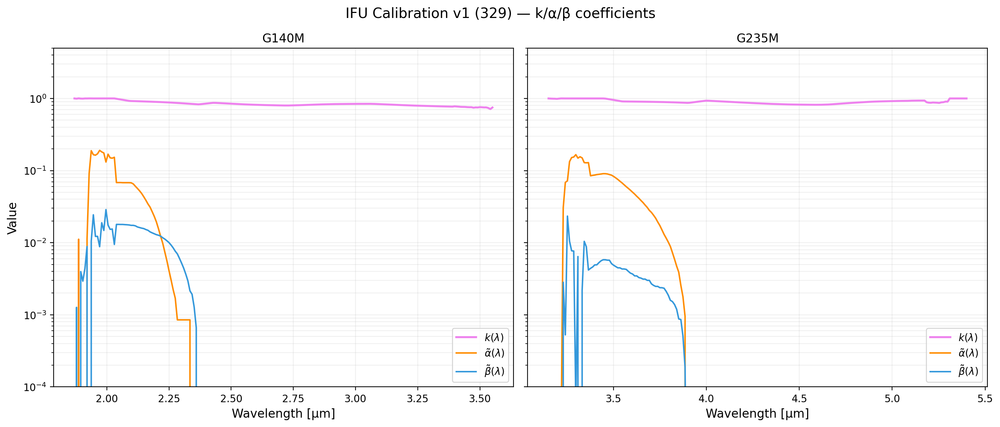
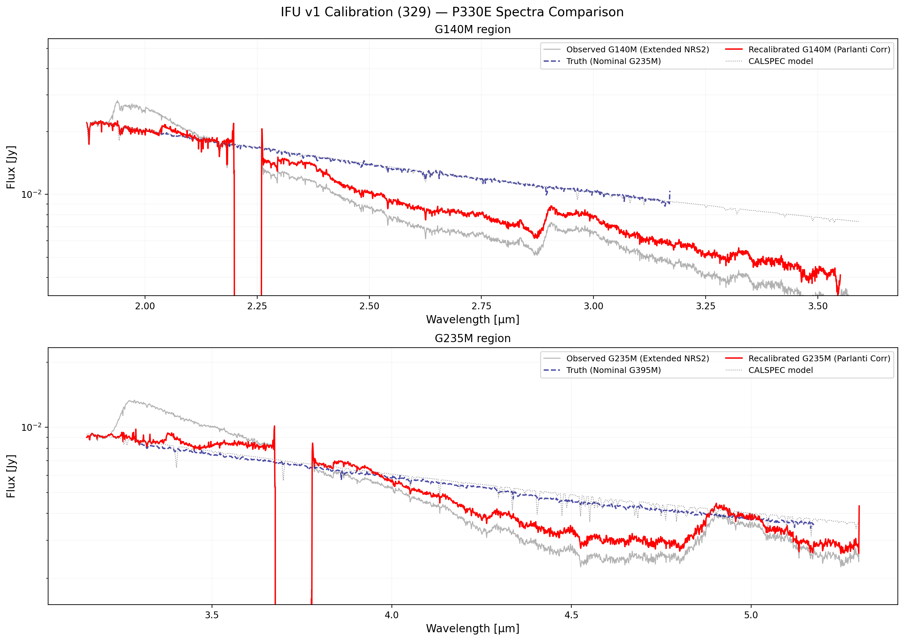
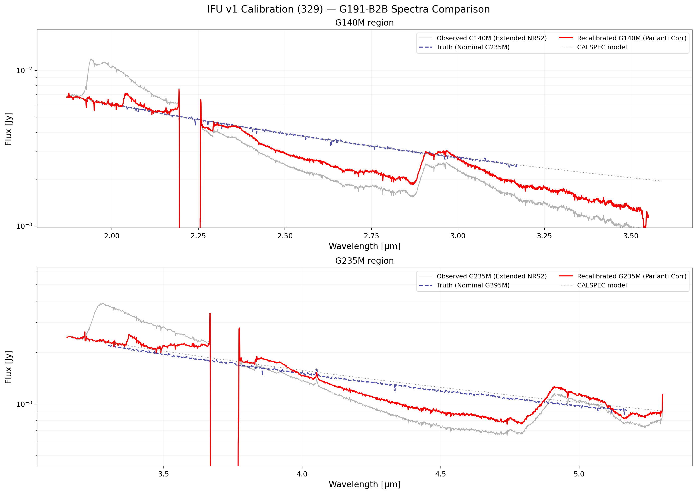
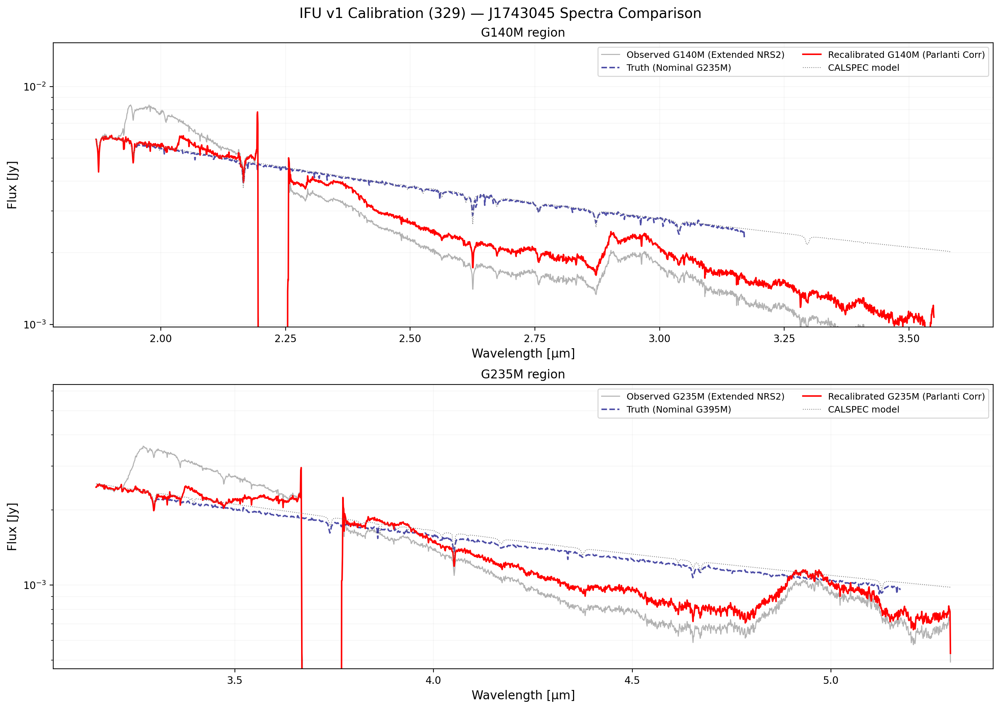

# NIRSpec Wavelength Extension Report — 329 IFU v1

**Date:** March 29, 2026
**Project:** NIRSpec Wavelength Extension Calibration
**Data Version:** IFU v1 coefficients

## Summary of Analysis
This report documents the derivation of calibration coefficients for the NIRSpec **IFU** wavelength extension. The analysis follows the same logic as the FS v1 analysis but using IFU stage3_ext products.

Three primary standard stars were used:
- **P330E** (G2V, PID 1538)
- **G191-B2B** (WD, PID 1537)
- **J1743045** (A8III, PID 1536)

The model follows Parlanti et al. (2025) (Equation 1):
$$S_{\text{obs}}(\lambda) = k(\lambda) \cdot f(\lambda) + \tilde{\alpha}(\lambda) \cdot f(\lambda/2) + \tilde{\beta}(\lambda) \cdot f(\lambda/3)$$

### Solver Results
| Grating | $k(\lambda)$ median | $k(\lambda)$ range | $\tilde{\alpha}$ max | $\tilde{\beta}$ max |
|:--------|:-----------|:-----------|:------|:------|
| G140M NRS2 | **0.833** | 0.712–1.003 | ≈ 0 | ≈ 0 |
| G235M NRS2 | **0.899** | 0.817–1.001 | ≈ 0 | ≈ 0 |

Note: For IFU v1, the solver found negligible higher-order contamination ($\tilde{\alpha} \approx \tilde{\beta} \approx 0$).

## Calibration Coefficients
Logarithmic plot for $k(\lambda)$, $\tilde{\alpha}(\lambda)$, and $\tilde{\beta}(\lambda)$ coefficients.

## Source Spectra Comparisons
For each reference source, we compare:
- **Observed GxxxM (Extended NRS2)**: The IFU stage3_ext extracted spectrum.
- **Truth (Nominal next-grating)**: IFU stage3 nominal spectrum for overlap region.
- **Recalibrated GxxxM (Parlanti Corr)**: Data corrected for $k$, $\tilde{\alpha}$, $\tilde{\beta}$.
- **CALSPEC model**: The intrinsic reference model.

### P330E

### G191-B2B

### J1743045

## Plotting Scripts
Scripts used to generate this report:
- [plot_ifu_v1_coeffs_log.py](plot_ifu_v1_coeffs_log.py)
- [plot_ifu_v1_source_spectra.py](plot_ifu_v1_source_spectra.py)

---
*Created automatically by Antigravity on 2026-03-29.*
