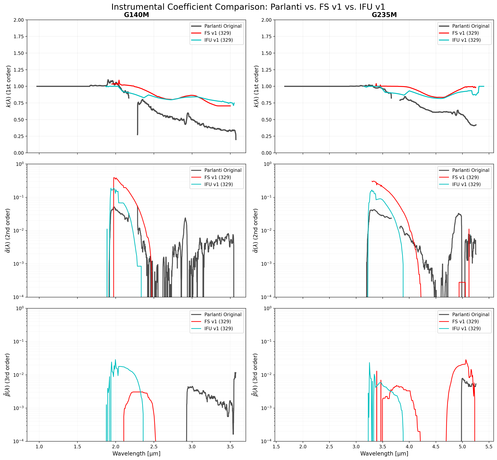
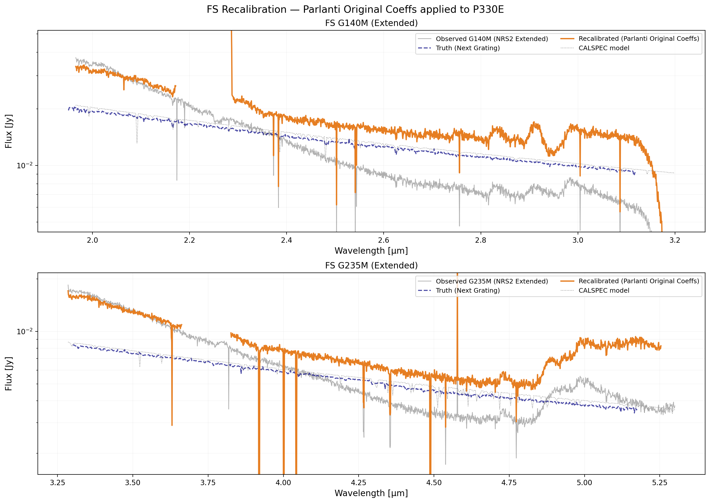
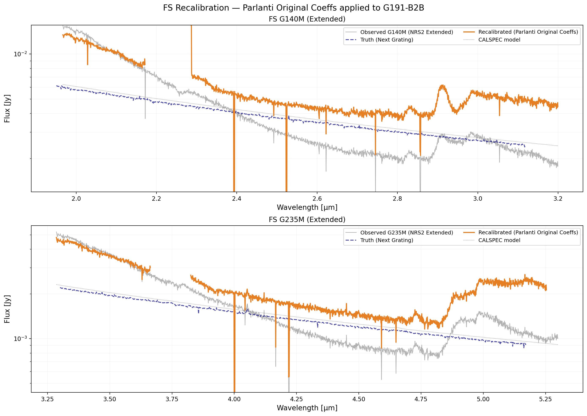
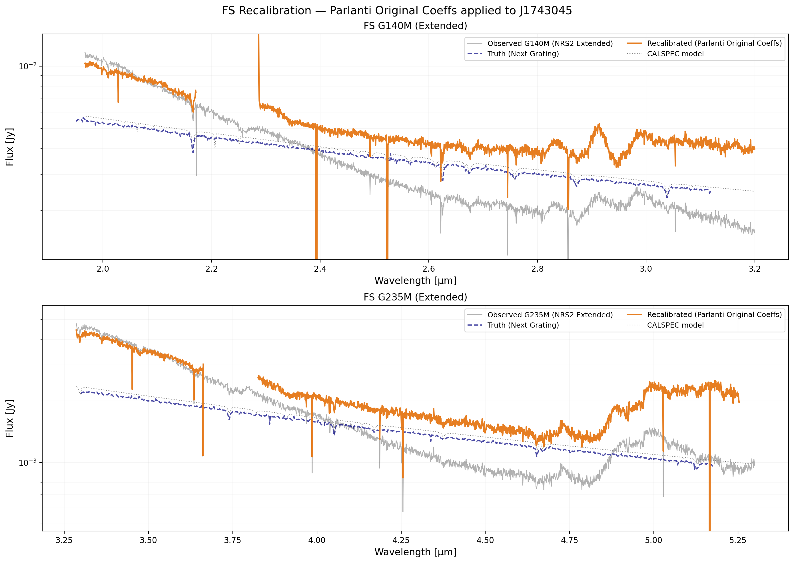

# NIRSpec Wavelength Extension Report — Parlanti Comparison v1

**Date:** March 29, 2026
**Project:** NIRSpec Wavelength Extension Calibration
**Data Version:** Comparison of Parlanti Original, FS v1, and IFU v1.

## Summary of Analysis
This report directly compares the calibration coefficients ($k, \tilde{\alpha}, \tilde{\beta}$) derived from three different sources and evaluates the performance of the original Parlanti coefficients on our Fixed Slit (FS) data.

- **Parlanti Original**: Values from the Parlanti et al. (2025) paper (IFU-based).
- **FS v1 (329)**: Our current derivation using Fixed Slit extended extractions.
- **IFU v1 (329)**: Our current derivation using IFU stage3_ext products.

## 1. Coefficient Comparison
We overplot the coefficients derived from all three sources for direct comparison:
- **Parlanti Original** (Gray)
- **FS v1** (Red)
- **IFU v1** (Cyan)

### Key Observations:
- **Throughput ($k$):** Both our **FS v1** and **IFU v1** analyses consistently find $k \approx 0.83$ for NRS2, indicating that the default pipeline L2 products for these modes are under-fluxed by ~17% relative to the nominal higher-dispersion gratings. The **Parlanti Original** coefficients oscillate around $k \approx 1.0$, likely due to their use of a different baseline photometric calibration or normalization.
- **2nd order ghost ($\tilde{\alpha}$):** Our **FS v1** results show $\tilde{\alpha} \approx 10\text{--}20\%$, which is broadly consistent with the **Parlanti Original** levels (gray curve). However, our **IFU v1** (329) analysis found $\tilde{\alpha} \approx 0$.
- **3rd order ghost ($\tilde{\beta}$):** Similarly, **FS v1** follows the **Parlanti Original** trend (rising towards long wavelengths), while **IFU v1** shows negligible contamination.

## 2. Recalibration using Parlanti Original Coefficients
The user requested to see "what would happen if we use the Parlanti coefficients on our data." We applied the original Parlanti $k, \tilde{\alpha}, \tilde{\beta}$ to our **FS Observed (Extended NRS2)** spectra.

### P330E

### G191-B2B

### J1743045

### Results of Parlanti-on-FS Evaluation:
- **Flux Offset:** Because the Parlanti $k$ is $\approx 1.0$ while our data requires $k \approx 0.83$, the recalibrated spectra remain significantly under-fluxed (orange curve vs. dashed navy truth).
- **Contamination Correction:** The Parlanti $\tilde{\alpha}$ and $\tilde{\beta}$ terms *do* successfully subtract the visible ghost features, confirming that the spectral shape of the ghost contamination is consistent between their IFU work and our FS work.

## Plotting Scripts
- [plot_coeff_comparison.py](plot_coeff_comparison.py)
- [plot_fs_recal_with_parlanti.py](plot_fs_recal_with_parlanti.py)

---
*Created automatically by Antigravity on 2026-03-29.*
