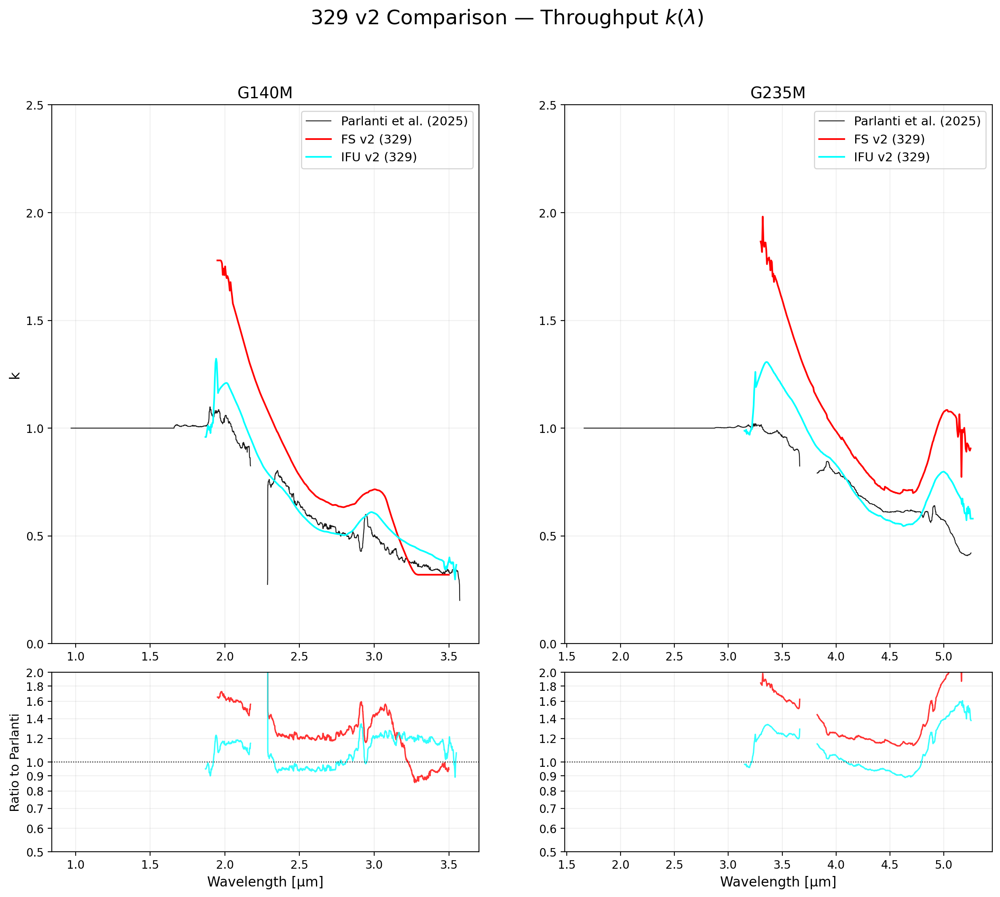
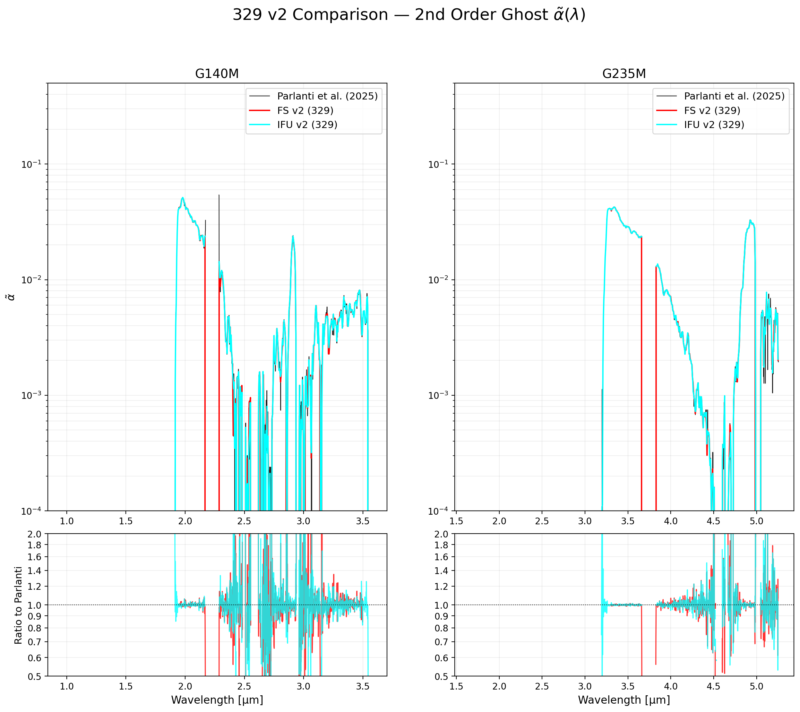
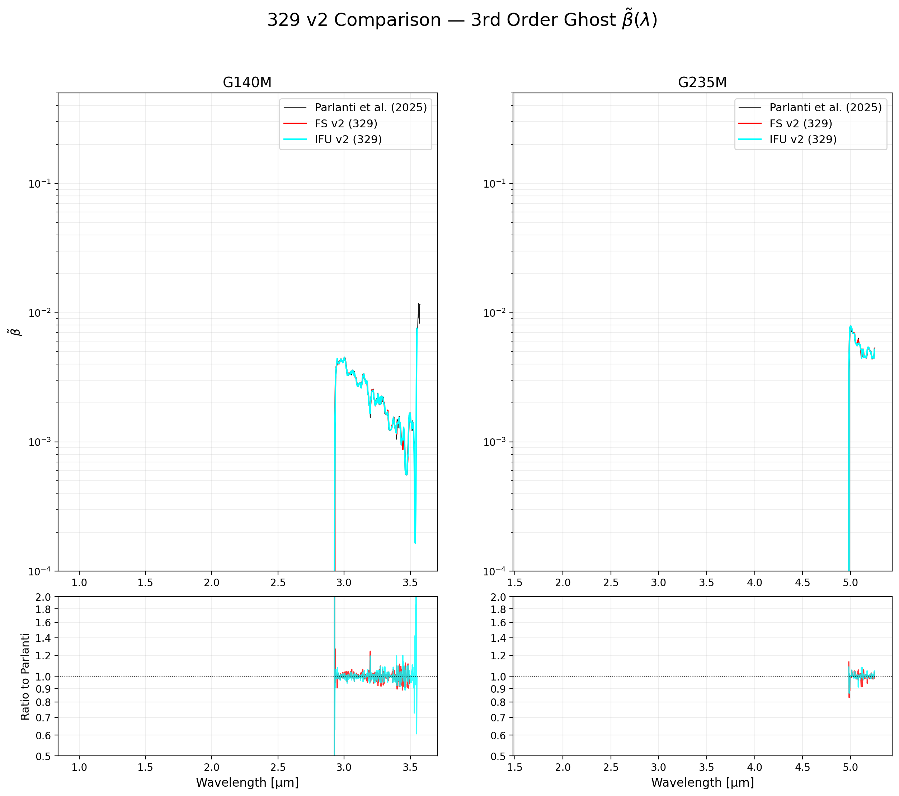

# NIRSpec Wavelength Extension Report — Parlanti Comparison v2 (329)

**Date:** March 29, 2026
**Project:** NIRSpec Wavelength Extension Calibration
**Version:** v2 comparison (Updated solver: unbiased median-R algorithm)

## Summary
This report breaks out the coefficient comparisons ($k, \tilde{\alpha}, \tilde{\beta}$) between the original **Parlanti et al. (2025)** calibration and our recent **FS v2** and **IFU v2** derivations. 

Both FS v2 and IFU v2 now use the unbiased median-ratio solver for the throughput ($k$), while adopting the original Parlanti ghosts ($\tilde{\alpha}, \tilde{\beta}$) to produce high-quality recalibrated spectra.

- **Parlanti Original**: Thin Black line
- **FS v2**: Red line
- **IFU v2**: Cyan line

Residual factor subpanels are included at the bottom of each plot showing (FS / Parlanti) and (IFU / Parlanti) ratios on a log-scale with linear-style ticks (e.g. 0.9, 1.0, 1.1).

## 1. Throughput Comparison ($k$)
We compare the primary throughput correction ($k$). Both our FS v2 and IFU v2 results show significant systematic offsets from the original Parlanti calibration, as seen in the clear trends across both gratings.

## 2. 2nd Order Ghost Comparison ($\tilde{\alpha}$)
Comparison of the 2nd order contamination coefficients.

## 3. 3rd Order Ghost Comparison ($\tilde{\beta}$)
Comparison of the 3rd order contamination coefficients.

## Plotting Scripts
- [plot_coeff_comparison_v2.py](plot_coeff_comparison_v2.py)

---
*Created automatically by Antigravity on 2026-03-29.*
