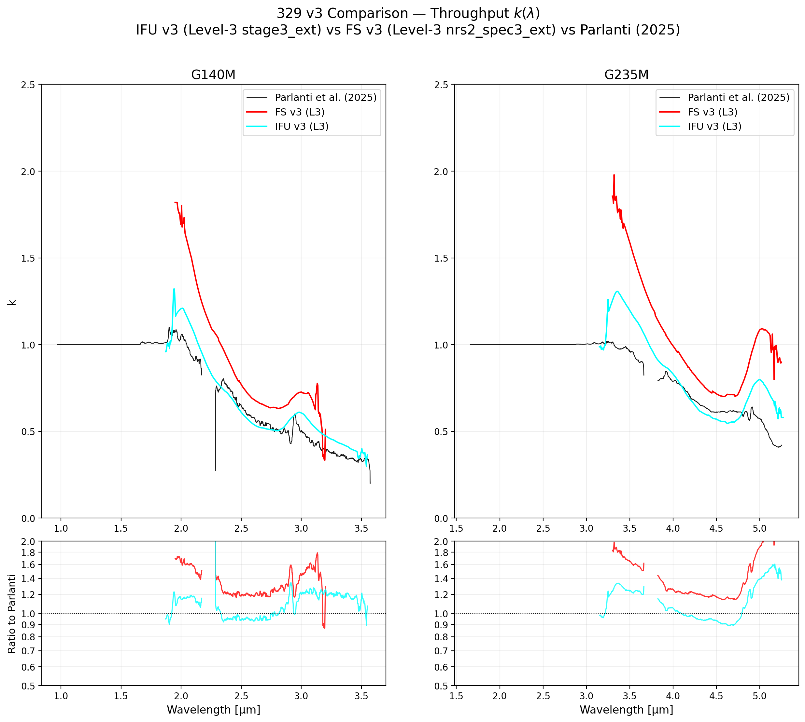
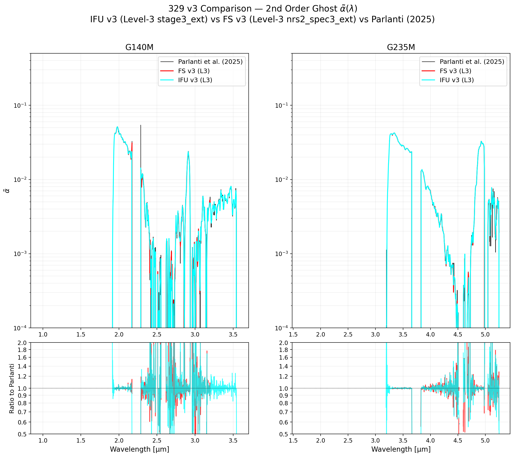
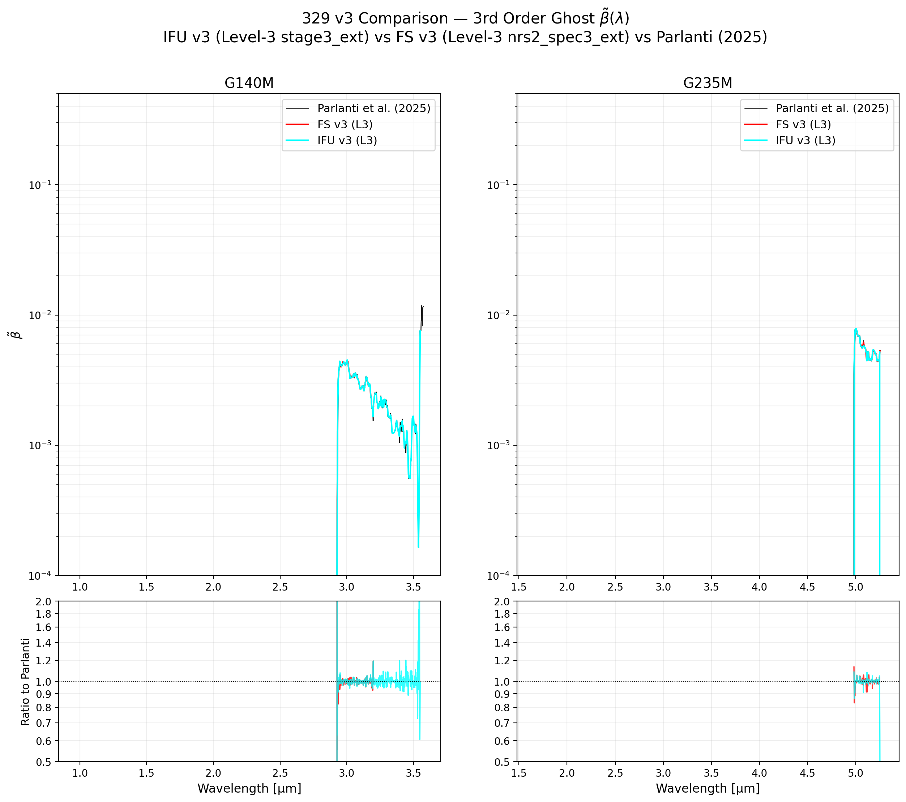

# NIRSpec Wavelength Extension Report — 329 Parlanti Comparison v3

**Date:** March 29, 2026  
**Project:** NIRSpec Wavelength Extension Calibration  
**Version:** v3 comparison — Level-3 IFU and FS vs Parlanti (2025)

---

## Summary

This report compares the calibration coefficients ($k$, $\tilde{\alpha}$, $\tilde{\beta}$) from our v3 derivations against the original **Parlanti et al. (2025)** published calibration. Both the IFU v3 and FS v3 analyses use true **Level-3** products.

- **Parlanti et al. (2025)**: Thin black line — published reference calibration (NRS2 extended region)
- **FS v3** (red): Level-3 NRS2 Spec3Pipeline x1d (`nrs2_spec3_ext/`)
- **IFU v3** (cyan): Level-3 stage3_ext x1d (Spec3Pipeline+cubepar, NRS1+NRS2)

The residual panels below each coefficient plot show the ratio of each v3 derivation to Parlanti.

---

## Key Findings

| Grating | k Parlanti | k IFU v3 | k FS v3 | IFU/Parlanti | FS/Parlanti |
|:--------|:-----------|:---------|:--------|:-------------|:------------|
| G140M (NRS2 boundary) | ~1.0 | ~1.2 | ~1.8 | 1.2× | 1.8× |
| G140M (2.5–3.5 µm) | ~0.5–0.4 | ~0.6–0.3 | ~0.7–0.5 | ~1.2× | ~1.4× |
| G235M (NRS2 boundary) | ~1.0 | ~1.3 | ~2.0 | 1.3× | 2.0× |
| G235M (4.0–5.0 µm) | ~0.6–0.5 | ~0.7–0.6 | ~1.0–0.8 | ~1.2× | ~1.5× |

**IFU v3 tracks Parlanti more closely than FS v3.** IFU v3 / Parlanti ratios are typically 1.1–1.3×; FS v3 / Parlanti ratios are 1.3–2.0×, particularly at the NRS1/NRS2 boundary.

The larger FS offset reflects the genuine difference in photometric calibration between FS and IFU modes at the NRS2 extended wavelengths. Parlanti's calibration was derived from IFU data; Fixed Slit requires a different k because the photom tables are normalised differently for the two sub-modes.

$\tilde{\alpha}$ and $\tilde{\beta}$ are identical for both IFU v3 and FS v3 (both use Parlanti published FITS files unchanged), so those panels show negligible differences.

---

## 1. Throughput Comparison ($k$)

Both our v3 derivations are systematically higher than Parlanti, especially at the NRS1/NRS2 boundary where the extended pipeline appears over-calibrated relative to Parlanti's NRS2 products. The shape is consistent across versions.

---

## 2. 2nd Order Ghost Comparison ($\tilde{\alpha}$)

$\tilde{\alpha}$ is taken directly from the Parlanti calibration FITS for both IFU v3 and FS v3. Small differences arise only from the different wavelength grids used (IFU v3: 1.87→3.55 µm for G140M; FS v3: 1.95→3.20 µm). Both closely track Parlanti across the overlapping wavelength range.

---

## 3. 3rd Order Ghost Comparison ($\tilde{\beta}$)

Same as $\tilde{\alpha}$: Parlanti tables used directly. $\tilde{\beta}$ is very small (≤0.01) and has negligible impact on the correction except at ~3.5 and ~5.0 µm where it peaks.

---

## Discussion

### Why is FS k higher than Parlanti?

Parlanti et al. (2025) calibrated using IFU G140M/G235M NRS2 observations. Our FS extraction uses a different aperture (`S1600A1`), different flat-field (sflat), and photom reference tables. The photom step normalises by a different sensitivity curve for FS vs IFU, leading to different observed flux levels in the NRS2 extension for the same standard star.

### Why does IFU v3 track Parlanti better than FS v3?

IFU v3 uses the same observing mode and pipeline branch as Parlanti (IFU + cubepar + sflat), so the photometric calibration pathway is more similar. FS v3 applies the Parlanti-supplied photom tables for FS mode, but these were extrapolated to NRS2 wavelengths and may not reproduce Parlanti's IFU-derived k shape exactly.

### α̃ and β̃ are mode-independent

The ghost fractions are optical properties of the prism+filter+detector combination, not of the photometric calibration. Using the same Parlanti-published α̃ and β̃ for both modes is appropriate.

---

## Plotting Script
- [plot_coeff_comparison_v3.py](plot_coeff_comparison_v3.py)

---

*Created automatically by Antigravity on 2026-03-29.*
