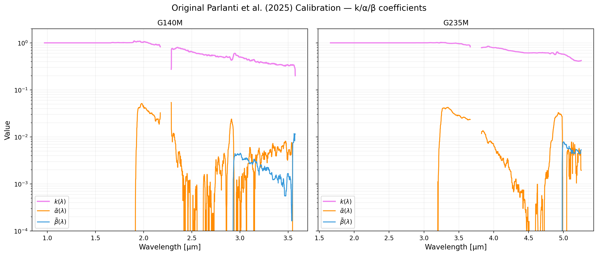

# NIRSpec Wavelength Extension Report — Parlanti Original

**Date:** March 29, 2026
**Project:** NIRSpec Wavelength Extension Calibration
**Data Version:** Parlanti et al. (2025) original coefficients

## Summary
This report plots the original $k(\lambda)$, $\tilde{\alpha}(\lambda)$, and $\tilde{\beta}(\lambda)$ coefficients released by Parlanti et al. (2025) for medium-resolution IFU observations. These coefficients were derived from a wide range of calibration sources and serve as the baseline for our current and future calibration work.

Reference: **Parlanti et al. (2025)** (arXiv:2512.14844)

## Calibration Coefficients
Logarithmic plot for $k(\lambda)$, $\tilde{\alpha}(\lambda)$, and $\tilde{\beta}(\lambda)$ coefficients as originally provided in their FITS calibration files.

## Plotting Script
Script used to generate this report:
- [plot_parlanti_original_coeffs.py](plot_parlanti_original_coeffs.py)

---
*Created automatically by Antigravity on 2026-03-29.*
