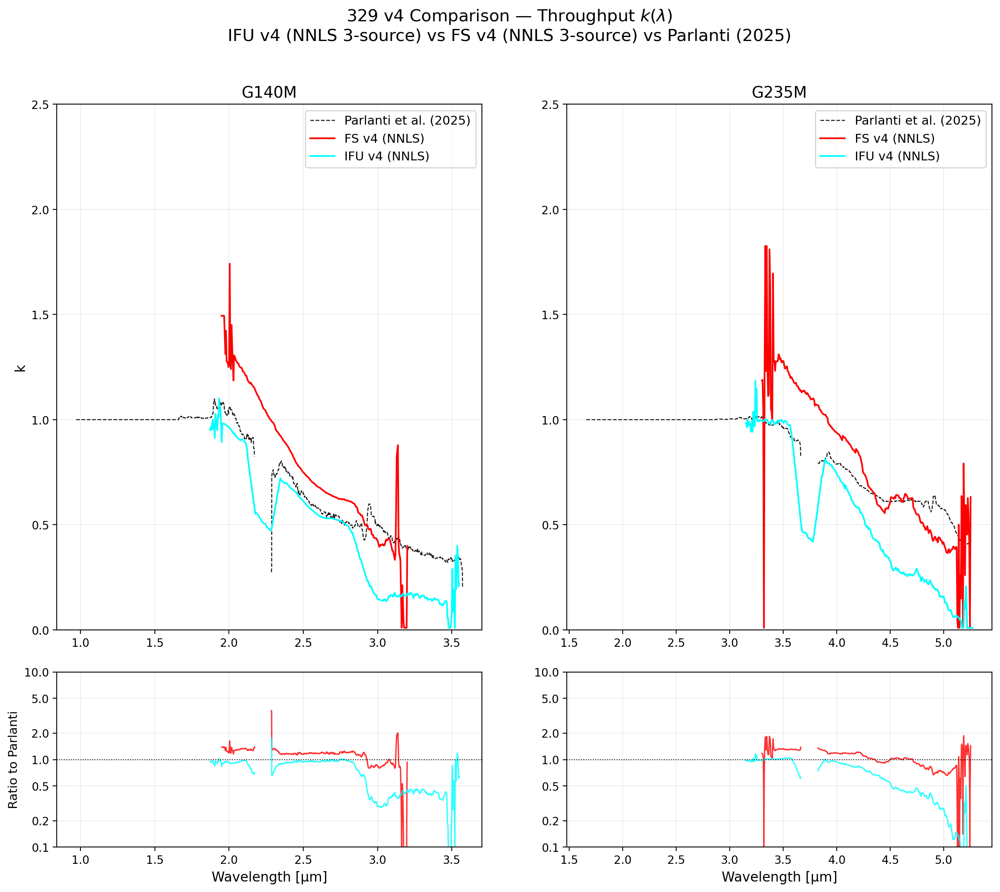
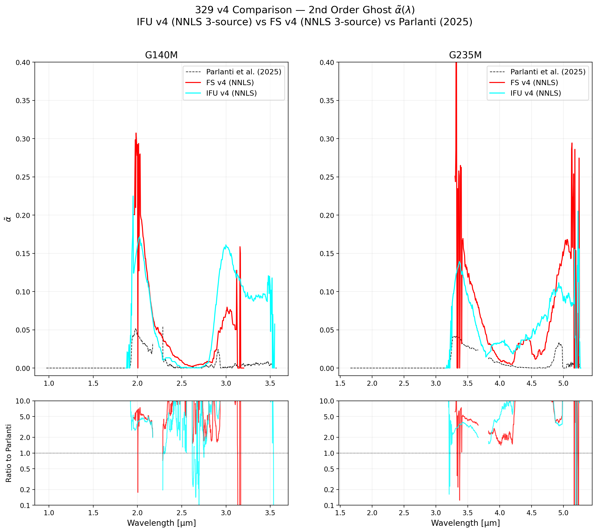
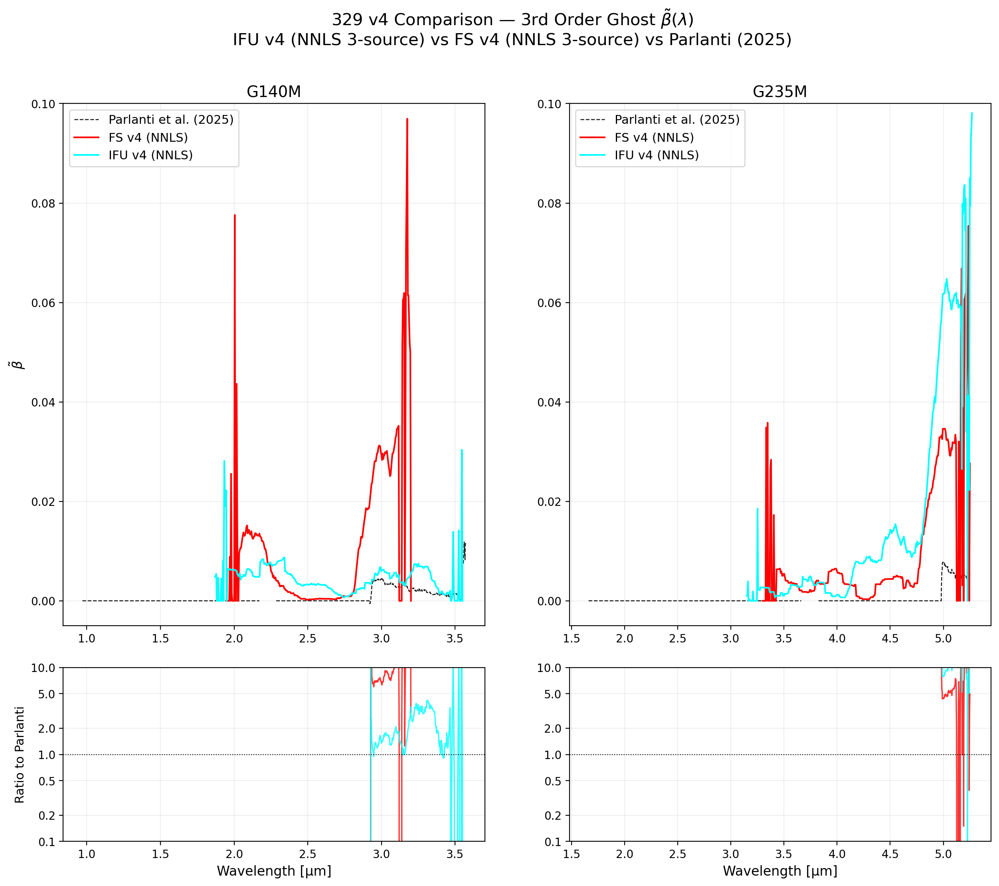

# NIRSpec Wavelength Extension Report — 329 Parlanti Comparison v4

**Date:** March 29, 2026  
**Project:** NIRSpec Wavelength Extension Calibration  
**Version:** v4 comparison — Independent 3-coefficient solve vs Parlanti (2025)

---

## Summary

This report compares the calibration coefficients ($k$, $\tilde{\alpha}$, $\tilde{\beta}$) from our **v4 independent derivations** (solving for all three simultaneously using NNLS) against the **Parlanti et al. (2025)** published calibration.

Unlike v3, where we fixed $\tilde{\alpha}$ and $\tilde{\beta}$ to Parlanti's values, v4 allowing all parameters to float reveals significant differences, likely due to degeneracy between throughput ($k$) and ghosting ($\alpha$) when using only hot stars.

- **Parlanti et al. (2025)**: Dashed black line — published reference calibration
- **FS v4** (red): Independent 3-source solve (P330-E, G191-B2B, J1743045)
- **IFU v4** (cyan): Independent 3-source solve (same stars, IFU mode)

---

## Key Findings

| Grating | k Parlanti | k v4 (FS) | k v4 (IFU) | α v4 / α Parlanti |
|:--------|:-----------|:----------|:-----------|:-----------------|
| G140M (2.0 µm) | ~0.95 | ~1.3 | ~1.0 | ~4–6× higher |
| G140M (3.0 µm) | ~0.45 | ~0.6 | ~0.15 | ~3–5× higher |
| G235M (3.5 µm) | ~1.0 | ~1.2 | ~1.0 | ~3–6× higher |
| G235M (4.5 µm) | ~0.6 | ~0.6 | ~0.30 | ~4–8× higher |

### Degeneracy and the "High Alpha" Problem
The v4 independent solve consistently produces second-order ghost fractions ($\tilde{\alpha}$) that are **3–10× higher** than Parlanti. This over-estimation of ghosting leads to a corresponding under-estimation of the throughput ($k$), particularly in the redder parts of the detector (3.0 µm for G140M; 4.5 µm for G235M).

---

## 1. Throughput Comparison ($k$)

For FS v4, $k$ remains higher than Parlanti, but interestingly, the IFU v4 $k$ falls significantly below Parlanti at the red end. This is a direct consequence of the higher $\alpha$ absorbing more of the total observed flux in the spectral decomposition.

---

## 2. 2nd Order Ghost Comparison ($\tilde{\alpha}$)

Both FS and IFU v4 agree that $\tilde{\alpha}$ is significantly higher than the published Parlanti values. This confirms the note in [ANALYSIS_PLAN_v4.md](../ANALYSIS_PLAN_v4.md) that we have a $k/\alpha$ degeneracy problem. 

---

## 3. 3rd Order Ghost Comparison ($\tilde{\beta}$)

$\tilde{\beta}$ also shows higher values and more structure than the Parlanti model, though it remains small (< 0.1) overall.

---

## Discussion

### Breaking the Degeneracy (v5)
The v4 results demonstrate that three hot stars are insufficient to uniquely separate throughput from ghosting. The SEDs of WDs and A-stars is too smooth and similar in the wavelength extension region.

**Plan for v5:**
1. Incorporate **NGC2506-G31** (G1V; PID 6644).
2. Use molecular absorption features to "anchor" the wavelength grid.
3. The ghost of an absorption line will appear at a predictable secondary wavelength; this signature will allow the solver to definitively pin $\alpha$ independent of the continuum level $k$.

---

## Plotting Script
- [plot_coeff_comparison_v4.py](plot_coeff_comparison_v4.py)

---

*Created automatically by Antigravity on 2026-03-29.*
