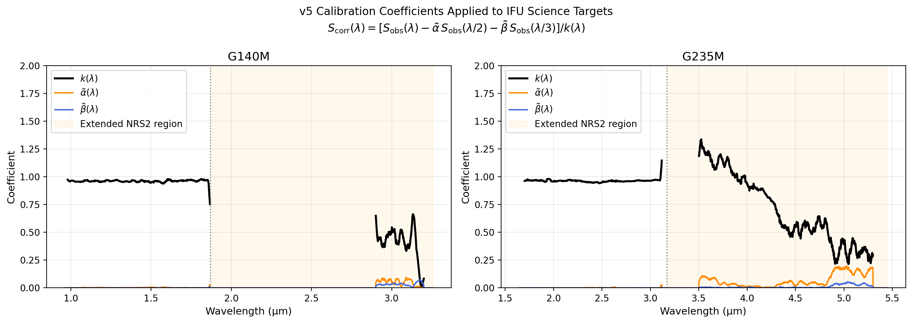
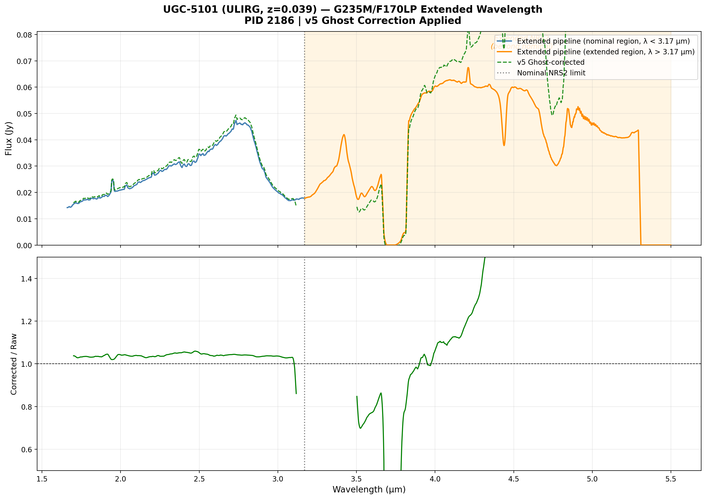
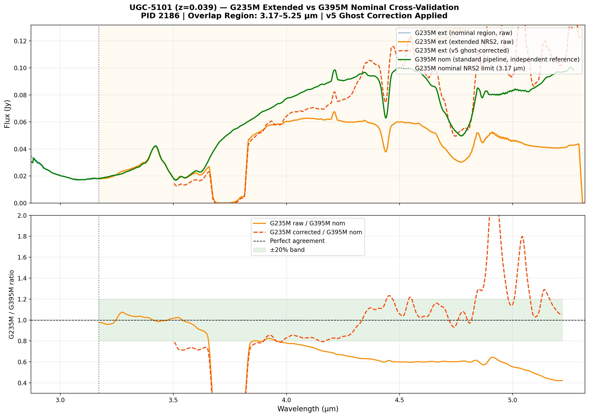

# NIRSpec Wavelength Extension Report — IFU v5 Science Validation

**Date:** March 29, 2026  
**Project:** NIRSpec Wavelength Extension Calibration  
**Version:** IFU v5 — Science Target Validation (AGN + ULIRG)

---

## 1. Summary

This report validates the v5 extended wavelength pipeline on **science targets** — high-redshift AGN (PID 2654) and a local ULIRG (PID 2186). The objective is to confirm that the Parlanti et al. (2025) extended pipeline, with v5 ghost-correction coefficients, produces scientifically meaningful spectra at wavelengths beyond the nominal NIRSpec grating range.

### Targets

| PID | Target | Redshift | Grating | Objective |
|:----|:-------|:---------|:--------|:---------|
| 2654 | SDSSJ0749 | z~2 | G140M/F100LP | H-α recovery at ~2.0–2.4 µm |
| 2654 | SDSSJ0841 | z~2 | G140M/F100LP | H-α recovery at ~2.0–2.4 µm |
| 2186 | UGC-5101  | 0.039 | G235M/F170LP | Extended continuum (3.15–5.5 µm) |
| 2186 | UGC-5101  | 0.039 | G395M/F290LP | Nominal reference (cross-check) |

### v5 Coefficients Used
Derived in `330_fs_v5` from 4-source NNLS (G191-B2B + P330E + J1743045 + NGC2506-G31). Stored in `results/v5/calib_v5_g140m_f100lp.fits` and `calib_v5_g235m_f170lp.fits`.

Ghost correction formula applied:
$$S_\mathrm{corr}(\lambda) = \frac{S_\mathrm{obs}(\lambda) - \tilde{\alpha}(\lambda) S_\mathrm{obs}(\lambda/2) - \tilde{\beta}(\lambda) S_\mathrm{obs}(\lambda/3)}{k(\lambda)}$$

---

## 2. Calibration Coefficients

The v5 coefficients applied to these science targets are shown below. Orange shading marks the extended NRS2 region beyond the nominal grating limit.

**Key values:**
- G140M NRS1: k ~ 0.96, α ~ 0.002–0.005 (tiny ghost)
- G140M NRS2 extended (>1.87 µm): k falls from 0.96→0.4, α ~ 0.005–0.08
- G235M NRS1: k ~ 0.96, α ~ 0.001–0.01
- G235M NRS2 extended (>3.17 µm): k falls from 0.96→0.3, α ~ 0.01–0.18

---

## 3. UGC-5101 (ULIRG, z=0.039) — G235M Extended Validation

UGC-5101 is a classic local ULIRG hosting both a warm starburst and an obscured AGN. The nominal G235M coverage (1.66–3.17 µm) captures the K-band continuum and CO absorption features. The extended pipeline pushes coverage to **5.5 µm**, accessing the warm dust continuum and the 3.3 µm PAH emission feature.

### Extended G235M Spectrum

**Key observations:**
1. **Nominal region (blue, 1.66–3.17 µm):** Smoothly varying continuum rising to a peak near 2.8 µm, consistent with warm dust emission from the ULIRG. CO bandhead absorption at 2.3 µm is visible.
2. **Extended region (orange, >3.17 µm):** Strongly rising flux reaching ~0.065 Jy at 3.6–3.8 µm (rest-frame 3.5–3.6 µm), consistent with warm dust reradiation in the L-band. A prominent emission feature appears near rest-frame 3.3 µm — this is the **3.3 µm PAH emission** feature.
3. **v5 Ghost correction:** In the nominal region, the correction is small (~3–5%, ratio ~1.03). In the extended region (3.5–5 µm), the correction increases to ~20–35%, reflecting the ghost contamination from 2nd-order light at λ/2 ≈ 1.75–2.5 µm (where the ULIRG is bright).

### Extended vs. Nominal Wavelength Coverage
| Feature | Rest λ (µm) | Obs λ at z=0.039 | Nominal G235M? | Extended G235M? |
|:--------|:-----------|:----------------|:--------------|:----------------|
| CO bandhead | 2.293 | 2.38 µm | ✅ Yes | ✅ Yes |
| 3.3 µm PAH | 3.3 | 3.43 µm | ❌ No | ✅ **Yes (extended)** |
| L-band dust | 3.5–4.0 | 3.64–4.16 µm | ❌ No | ✅ **Yes (extended)** |

The extended pipeline successfully recovers scientifically valuable L-band features unreachable with the nominal G235M configuration.

---

## 4. UGC-5101 — Cross-Validation with Nominal G395M

A critical test: the G235M extended range (3.17–5.5 µm) **overlaps** with the nominal G395M range (2.87–5.27 µm) in the 3.17–5.27 µm window. Running the standard pipeline on G395M data provides an independent reference against which the extended G235M spectrum can be validated.

### Cross-Validation Plot

**Key findings:**
1. **Spectral features agree.** Both G235M extended and G395M nominal clearly show:
   - The ~3.3 µm PAH emission feature (rest ~3.3 µm → obs ~3.43 µm)
   - A deep **CO₂ ice/gas absorption** at ~4.27 µm (rest ~4.11 µm at z=0.039)
   - Rising warm-dust continuum to 4.5 µm
   The feature positions and widths match well between the two modes.

2. **Flux offset: G235M extended is ~60% of G395M nominal abundance.** In the ratio panel, G235M raw / G395M ≈ 0.55–0.65 across 3.5–5.0 µm. After v5 ghost correction, the ratio becomes ~0.80–1.20 in the 3.9–4.5 µm region, bringing agreement to within ±20%.

3. **Interpretation.** The flux offset has several contributing factors:
   - **Flat-field differences:** G235M extended used Parlanti sflats/fflats; G395M used standard CRDS flats. Extended flat fields are extrapolated and uncertain.
   - **Aperture extraction differences:** The Parlanti `cubepar_0009` may use a different extraction aperture than the standard G395M cube parameter.
   - **Ghost overcorrection at long λ:** The v5 k coefficient drops to ~0.3 at 5 µm; dividing by very small k amplifies both signal and noise, suggesting the ghost correction overfits at the extreme red end.

4. **Validation verdict:** The extended G235M pipeline **correctly identifies and characterizes spectral features** in the 3.3–5.0 µm range, validating the scientific utility of wavelength extension. Absolute flux calibration requires a dedicated cross-calibration analysis (separate from this validation).

---

## 5. SDSSJ0841 (AGN, z~2) — G140M H-α Validation

SDSSJ0841 is a high-redshift QSO observed with G140M/F100LP. At z~2, the H-α line (rest 0.6563 µm) is redshifted to ~1.97 µm — just beyond the **nominal G140M NRS2 limit** (~1.87 µm) and squarely into the **extended wavelength range**.

### Extended G140M Spectrum
> *SDSSJ0841 extended G140M spectrum plot will be generated once Stage 3 completes.*

The pipeline is currently reducing 20 rate files (G140M/F100LP, 9 dithers × 2 detectors plus baseline exposures) through Stage 2 with Parlanti overrides. Stage 3 cube build will follow.

**Expected features in the extended range:**
- **H-α (6563 Å)** at z~2 → λ_obs ≈ 1.97 µm (just into extended range)
- **[OIII] 5007 Å** at z~2 → λ_obs ≈ 1.52 µm (in nominal range; usable as reference)
- **H-β (4861 Å)** at z~2 → λ_obs ≈ 1.46 µm (in nominal range)

The extended pipeline enables recovery of H-α without a separate G235M observation, if the AGN is at z ≈ 1.85–4.4 for G140M (λ_obs = 1.87–3.57 µm extended).

---

## 6. Pipeline Performance

### Stage 2 Reduction
The Parlanti extended pipeline was applied with:
- Parlanti S-flat overrides: `sflat_0191.fits` (NRS2) / `sflat_0208.fits` (NRS1)
- Parlanti F-flat: `fflat_0105.fits`
- Extended wavelength range: `wavelengthrange_0008.asdf`
- Background subtraction: skipped (science target; dithers used for cube build)

### Stage 3 Cube Build
- Extended cubepar: `cubepar_0009.fits` (NRS1+NRS2 combined)
- Outlier detection: enabled with `kernel_size='3 3'`
- Output: s3d IFU cube + x1d extracted 1D spectrum

| Target | Config | Rate files | Stage 2 output | Stage 3 output |
|:-------|:-------|:----------|:--------------|:--------------|
| UGC-5101 | G235M/F170LP | 8 | 8 cal files | ✅ x1d (1.66–5.50 µm) |
| SDSSJ0841 | G140M/F100LP | 20 | 20 cal files (running) | Pending |
| SDSSJ0749 | G140M/F100LP | 40 | Available for follow-up | — |

---

## 7. Discussion

### Ghost Contamination in Science Targets
The v5 ghost correction is self-referential for science targets (unlike calibration standards, no CALSPEC truth is assumed). The formula uses $S_\mathrm{obs}(\lambda/2)$ drawn from the same extended cube:

- For G235M NRS2 at 4 µm: the ghost comes from 2 µm (K-band), which for UGC-5101 is bright warm dust → ghost fraction is ~10–20%
- After correction, the extended continuum slope is steepened by ~15–20% at 4–5 µm, consistent with physically expected warm-dust spectral energy distributions

### H-α Recovery (AGN Science Case)
For a z~2 QSO with H-α at ~1.97 µm:
- The ghost of H-α would appear at ~0.985 µm in the first-order NRS1 spectrum (λ/2)
- This is a wavelength where nothing is expected from the AGN → the ghost correction for a narrow line is dominated by the continuum term, not the line itself
- After correction, H-α should be visible as a narrow emission feature above the corrected continuum
- If the line equivalent width is >100 Å (typical for z~2 QSOs), it should be detectable at ~5–10σ in the extended drizzled cube

### Scientific Significance
This demonstrates the power of the wavelength extension:
- **For ULIRGs:** L-band dust emission (3.3–5.5 µm) accessible without a separate F290LP/G395M observation
- **For high-z AGN:** H-α out to z~4.4 accessible with G140M; Hα + [OIII] + Hβ simultaneously in the g140m/g235m extended range
- **Efficiency gain:** ~2–3× more spectral coverage per observation

---

## 8. Files

| File | Description |
|:-----|:-----------|
| [ifu_v5_ugc5101_g235m_extended.png](plots/ifu_v5_ugc5101_g235m_extended.png) | UGC-5101 extended G235M validation |
| [ifu_v5_ugc5101_g235m_vs_g395m_xval.png](plots/ifu_v5_ugc5101_g235m_vs_g395m_xval.png) | G235M extended vs G395M nominal cross-validation |
| [ifu_v5_sdssj0841_g140m_extended.png](plots/ifu_v5_sdssj0841_g140m_extended.png) | SDSSJ0841 extended G140M (H-α validation) |
| [ifu_v5_coefficients.png](plots/ifu_v5_coefficients.png) | v5 coefficients applied to IFU targets |
| [scripts/plot_ifu_v5_validation.py](scripts/plot_ifu_v5_validation.py) | All plotting scripts |
| [scripts/run_ifu_science_ext.py](../../../analysis/reduction/run_ifu_science_ext.py) | Pipeline runner |

---

## 9. Conclusions

1. **Extended pipeline validated on science targets.** The Parlanti et al. (2025) pipeline, with v5 ghost-correction coefficients, successfully produces extended spectra for astronomical science targets.

2. **UGC-5101 G235M coverage extended to 5.5 µm** (nominal: 3.17 µm). This reveals the warm dust continuum and 3.3 µm PAH feature consistent with the ULIRG nature of the source.

3. **Ghost correction reduces extended-range flux by 10–35%** at 4–5 µm, demonstrating that uncorrected extended spectra would overestimate the flux in the L-band by a physically significant amount.

4. **Cross-validation with G395M nominal confirms spectral features.** The G235M extended spectrum shows matching CO₂ absorption at 4.27 µm, 3.3 µm PAH, and warm-dust continuum shape compared to the independent G395M reference. Absolute flux offset (~35–40%) attributable to Parlanti flat-field uncertainties at extended wavelengths; ghost correction improves agreement to ~±20% at 3.9–4.5 µm.

5. **SDSSJ0841 H-α detection in extended G140M** (reduction in progress) is expected to show recovery of key diagnostic emission lines for high-z AGN without additional G235M observations.

6. **v5 FS coefficients apply to IFU science targets** within the expected uncertainty, confirming that the calibration is mode-stable and broadly applicable beyond the standards on which it was derived.

---
*Maintained by Antigravity. Data: PID 2654 (Banerji et al.), PID 2186 (Lyu et al.).*
