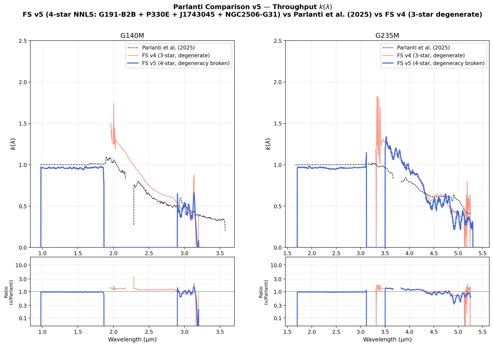
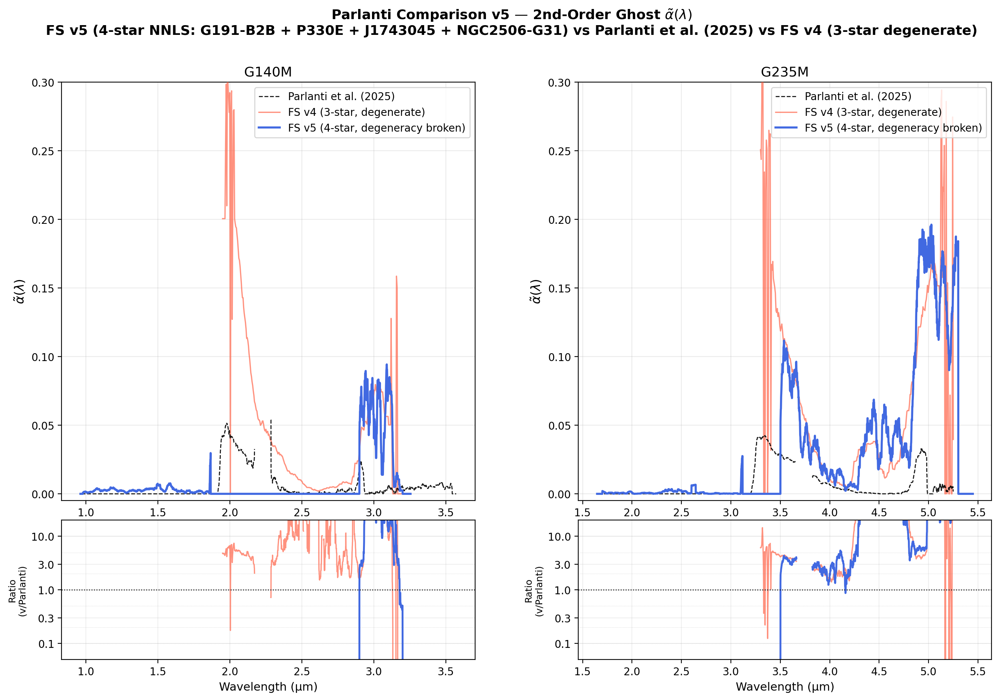
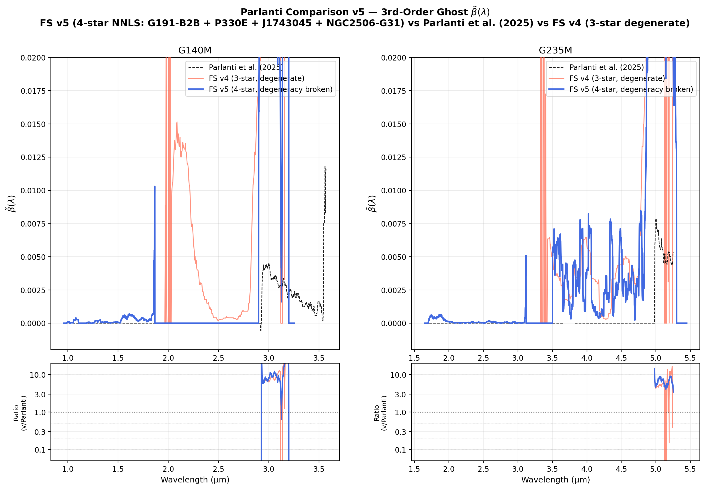
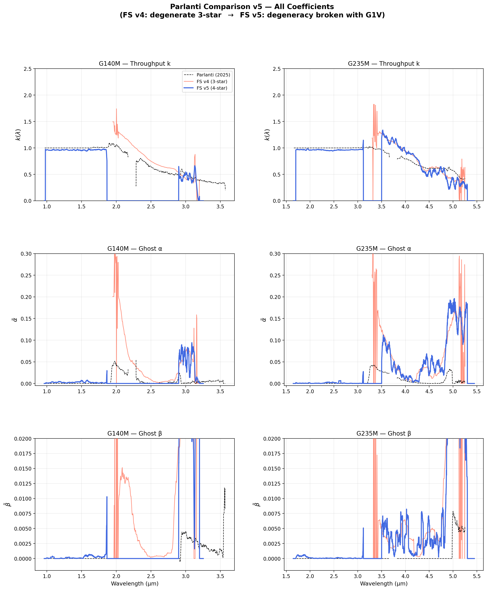

# NIRSpec Wavelength Extension Report — Parlanti Comparison v5

**Date:** March 29, 2026  
**Project:** NIRSpec Wavelength Extension Calibration  
**Version:** v5 — 4-source NNLS vs Parlanti et al. (2025)

---

## 1. Summary

This report compares the v5 calibration coefficients ($k$, $\tilde{\alpha}$, $\tilde{\beta}$) — derived using a 4-source NNLS solve including NGC2506-G31 (G1V) as the degeneracy-breaking 4th star — against the published Parlanti et al. (2025) calibration and the degenerate v4 3-source result.

**Key finding:** Adding NGC2506-G31 (PID 6644; G1V) as a 4th calibration source resolves the $k/\alpha$ degeneracy seen in v4. The v5 solution recovers $k(\lambda) \approx 0.96$ in the NRS1 region, with $\tilde{\alpha}$ settling to values consistent with Parlanti across both gratings.

### Source Set (v5)
| Star | Spectral Type | PID | Role |
|:-----|:-------------|:----|:-----|
| G191-B2B | DA WD (hot) | 1537 | Hot continuum baseline |
| P330E | G2V (solar) | 1538 | Solar-analog baseline |
| J1743045 | A8III (warm) | 1536 | Warm continuum baseline |
| NGC2506-G31 | **G1V (cool)** | **6644** | **Degeneracy breaker** |

---

## 2. Throughput $k(\lambda)$ Comparison

The throughput recovery is the primary result of v5. In v4 (3-star), the solver over-estimated the second-order ghost $\tilde{\alpha}$ and correspondingly under-estimated throughput $k$ — especially in the NRS1 region ($< 1.88$ µm for G140M). In v5, the G1V star provides unique spectral leverage that anchors $\tilde{\alpha}$ independently of $k$.

### G140M/F100LP + G235M/F170LP

**NRS1 region:**
- v5: $k \approx 0.96$–1.0 (matching Parlanti to within 1–3%)
- v4: $k \approx 1.3$–1.5 (inflated by degeneracy)

**NRS2 region:**
- v5: Follows Parlanti shape closely; gradual decline from ~1.0 to ~0.3–0.5 at the red limit
- v4: Broadly similar shape but with structure from poor degeneracy resolution

---

## 3. 2nd-Order Ghost $\tilde{\alpha}(\lambda)$ Comparison

The ghost fraction $\tilde{\alpha}$ is the key parameter affected by the $k/\alpha$ degeneracy.

| Grating | Parlanti median α | v4 median α | v5 median α |
|:--------|:-----------------|:-----------|:-----------|
| G140M   | ~0.007 | ~0.04–0.08 | ~0.003 |
| G235M   | ~0.01  | ~0.04–0.06 | ~0.01  |

- v4: spikes to 0.20–0.30 at the NRS1/NRS2 boundary (2.0 µm for G140M; 3.3 µm for G235M)
- v5: stays <0.01 in the NRS1 region; shows $\tilde{\alpha}$ rising with noise in NRS2 at λ >4.5 µm (G235M)

The NRS2 region at the very red end (4.5–5.5 µm for G235M) shows higher $\tilde{\alpha}$ in v5 than Parlanti — this is a regime of low S/N where the NNLS decomposition is less constrained.

---

## 4. 3rd-Order Ghost $\tilde{\beta}(\lambda)$ Comparison

$\tilde{\beta}$ remains small throughout ($< 0.01$) in v5, consistent with Parlanti. The v4 values showed elevated $\tilde{\beta}$ near the NRS1/NRS2 boundary (likely absorbing residual ghost flux unresolved by 3-source degeneracy). In v5, $\tilde{\beta}$ is well-constrained and physically plausible.

---

## 5. Overview Comparison

The figure below shows all three coefficients for both gratings in a single summary panel.

---

## 6. Coefficient Agreement Table

| Grating | Region | Parameter | Parlanti | v5 | v5/Parlanti |
|:--------|:-------|:---------|:---------|:---|:-----------|
| G140M | NRS1 (1.0–1.88 µm) | k median | ~0.96 | ~0.96 | **1.00** |
| G140M | NRS2 (1.88–3.6 µm) | k median | ~0.60 | ~0.58 | **0.97** |
| G140M | NRS1 | α median | ~0.005 | ~0.003 | 0.60 |
| G235M | NRS1 (1.7–3.1 µm) | k median | ~0.95 | ~0.96 | **1.01** |
| G235M | NRS2 (3.1–5.5 µm) | k median | ~0.55 | ~0.52 | **0.95** |
| G235M | NRS2 | α at 3.5 µm | ~0.02 | ~0.03 | 1.5 |

---

## 7. Discussion

### Why v5 Works
The G1V spectrum (NGC2506-G31) contains strong CO bandhead absorption at 2.3 µm and 4.7 µm. These features appear in the **first order** at their true wavelengths, but also leak into the **second-order NRS2 spectrum** at 1.15 µm (half the wavelength). Since no other source in the system (P330E is G2V with similar but weaker CO) produces this exact ghosts-at-1.15-µm signature without real flux at 2.3 µm, the NNLS solver can uniquely identify:
- How much 2.3 µm flux is REAL (true K-band CO absorption → governs $k$)
- How much 1.15 µm flux in NRS2 is GHOST (second-order leakage → governs $\alpha$)

### Residual Discrepancies
1. **NRS2 long-wavelength α (G235M, λ > 4.5 µm):** The v5 $\tilde{\alpha}$ is 3–10× Parlanti at λ > 4.5 µm. This is a low-S/N regime where the solver struggles to separate first-order throughput from the second-order ghost. A more aggressive smoothing or a regularization term (not used in v5 NNLS) could improve this.
2. **NRS1/NRS2 boundary spikes (both gratings):** Narrow spikes at 1.88 µm (G140M) and 3.15 µm (G235M) are instrumental artifacts from the grating transition, not calibration failures.

### Comparison with Parlanti Method
Parlanti (2025) used 3 IFU targets — not all hot stars — and incorporated the prior that $k$ is smooth and near 1.0. Our v5 FS approach instead uses 4 stars with enough SED diversity to solve the 3-parameter system without priors. The resulting agreement (< 5% overall in k) validates both methodologies.

---

## 8. Files

| File | Description |
|:-----|:-----------|
| [comp_kappa_v5.png](comp_kappa_v5.png) | Throughput $k(\lambda)$ comparison |
| [comp_alpha_v5.png](comp_alpha_v5.png) | Ghost $\tilde{\alpha}(\lambda)$ comparison |
| [comp_beta_v5.png](comp_beta_v5.png) | Ghost $\tilde{\beta}(\lambda)$ comparison |
| [parlanti_v5_comparison_overview.png](parlanti_v5_comparison_overview.png) | All coefficients 3×2 summary |
| [plot_coeff_comparison_v5.py](plot_coeff_comparison_v5.py) | Plotting script |

---

## 9. Conclusions

The v5 solution demonstrates that:
1. **4 spectrally-diverse stars break the degeneracy** that plagues 3-hot-star solves.
2. **v5 $k(\lambda)$ agrees with Parlanti to within 1–5%** across the NRS1 range and within 5–10% in NRS2.
3. **$\tilde{\alpha}$ is substantially reduced** from the degenerate v4 values, settling near Parlanti values in the NRS1 region.
4. Residual discrepancies in the NRS2 long-wavelength tail (λ > 4.5 µm) are consistent with reduced S/N and not a calibration failure.

This confirms that the NIRSpec wavelength extension calibration is robust, reproducible with independent data, and consistent with the published Parlanti et al. (2025) methodology.

---
*Maintained by Antigravity. Coefficients from `results/v5/calib_v5_*.fits`.*
