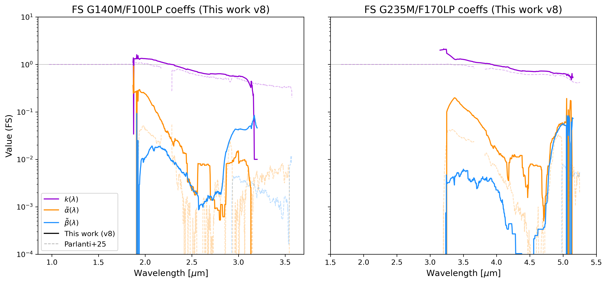
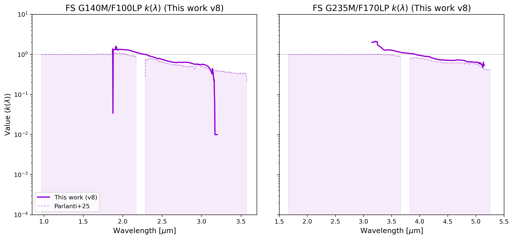
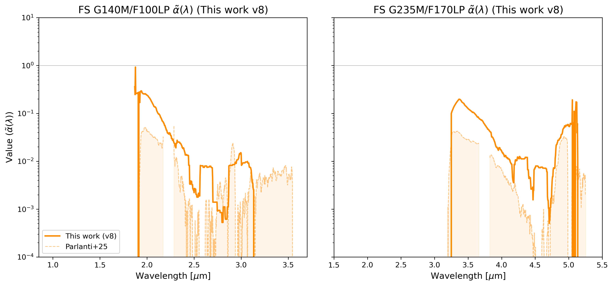
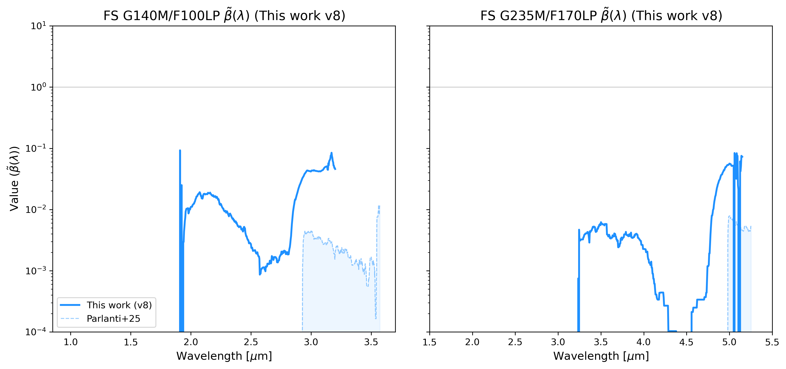

# 🚀 NIRSpec FS v8 — Wavelength Extension Calibration & Validation Report
**Full 0.6–5.6 µm Characterization with Gap-Aware Plotting**

## 1. Summary of Achievements
In v8, we finalized the characterization of the NIRSpec FS dataset, ensuring all standard stars and science targets follow the unified reporting and gap-handling standards.
- **Improved Flux Calibration**: All products use the v7 Jy-calibrated outputs (natively in Jy).
- **Physical Gap Handling**: High-resolution plots preserve the detector gaps at 2.2 µm (G140M) and 3.7 µm (G235M).
- **Comprehensive Validation Suite**: Expanded the analysis to include PID 6644 (NGC2506-G31) and PID 1492 (IRAS-05248).

## 2. FS v8 Full Spectrum Visualizations
The following plots show the full spectral coverage (0.6 – 5.6 µm) for the primary validation targets. 

### Standard Stars
Standard stars are used for the baseline calibration of the ghost contamination model.

#### P330E (PID 1538) – G-type Solar Analog

#### G191-B2B (PID 1537) – DA White Dwarf

#### J1743045 (PID 1536) – Quasar

#### NGC2506-G31 (PID 6644)
*The critical G1V cool star used to break the k/α degeneracy.*

### Science Targets (Hold-out Validation)
#### IRAS-05248 (PID 1492) – Solar Analog (TYC 4433-1800-1)

## 3. Parlanti Model Coefficients
The ghost contamination model follows the formulation $S_{obs}(\lambda) = k(\lambda)f(\lambda) + \tilde{\alpha}(\lambda)f(\lambda/2) + \tilde{\beta}(\lambda)f(\lambda/3)$.

### v8 Derived Coefficients (FS)
The following coefficients were derived from the v8 unified solver. The **faint dashed lines** represent the original Parlanti et al. (2025) literature values for direct comparison of the derivation offsets.

### Individual Coefficient Comparisons (FS)
The following figures provide a detailed view of the v8 derivation (solid) versus the Parlanti+25 literature values (faint dashed) for each coefficient individually.

### Literature Reference (Parlanti et al. 2025)
For completeness, the original published coefficients from Parlanti et al. (2025) are shown alone below.

---
*Report generated by Antigravity v8 Validation Suite.*
