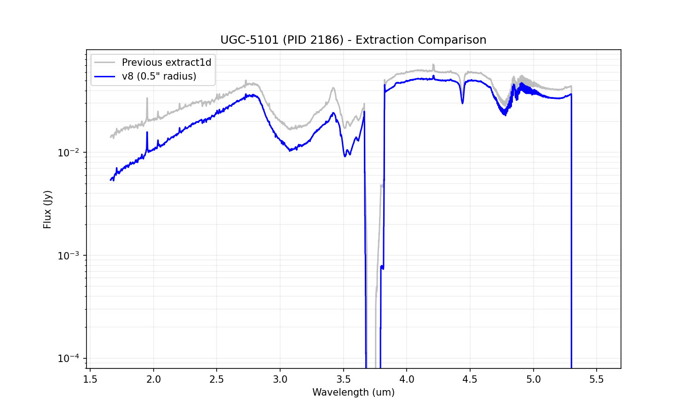
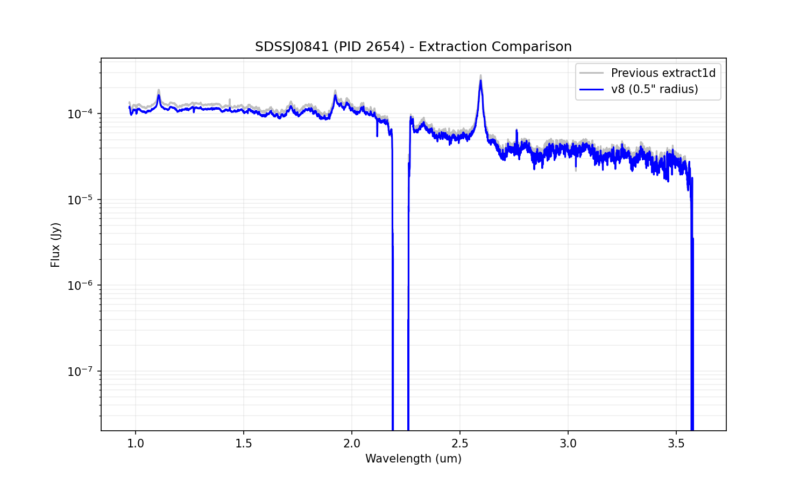

# IFU v8 Extracted Spectra Comparison

This report compares the v8 0.5" radius circular aperture extractions (summed in Jy) to the previous standard `extract1d` results.

## UGC-5101 (PID 2186)

**Peak Spaxel (pixel coords):** (27, 34)

- Median flux level (v8): 0.025881 Jy
- Median flux level (previous): 0.034440 Jy
- Median flux ratio (v8 / previous): 0.751
- Note: The v8 extraction uses a fixed circular aperture of 0.5" radius centered on the brightest pixel, with proper `MJy/sr` to `Jy` conversion via `PIXAR_SR`.

## SDSSJ0841 (PID 2654)

**Peak Spaxel (pixel coords):** (27, 25)

- Median flux level (v8): 0.000073 Jy
- Median flux level (previous): 0.000082 Jy
- Median flux ratio (v8 / previous): 0.886
- Note: The v8 extraction uses a fixed circular aperture of 0.5" radius centered on the brightest pixel, with proper `MJy/sr` to `Jy` conversion via `PIXAR_SR`.

