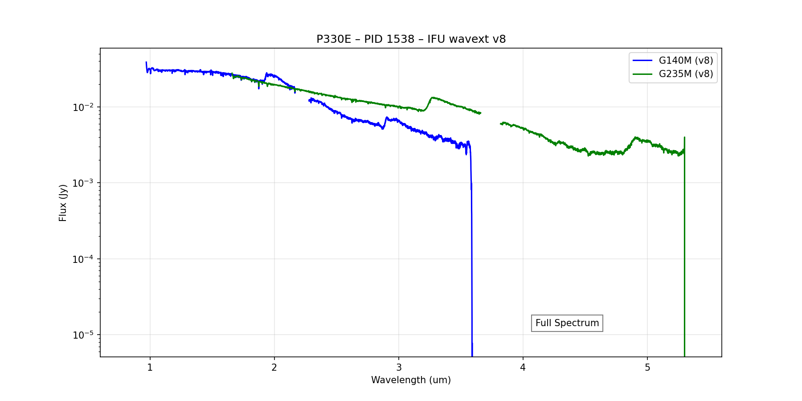
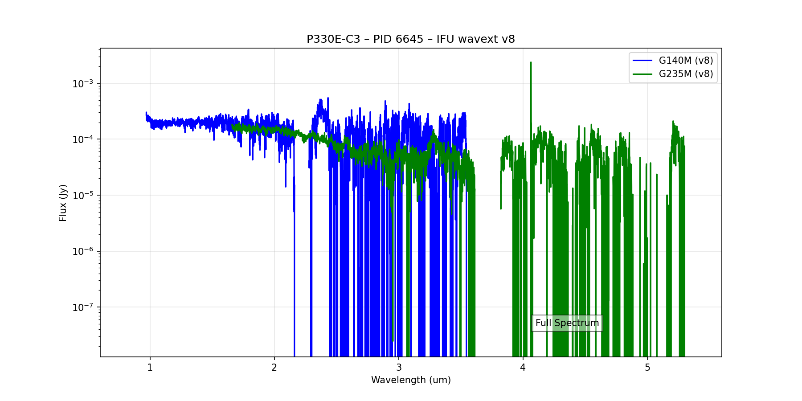
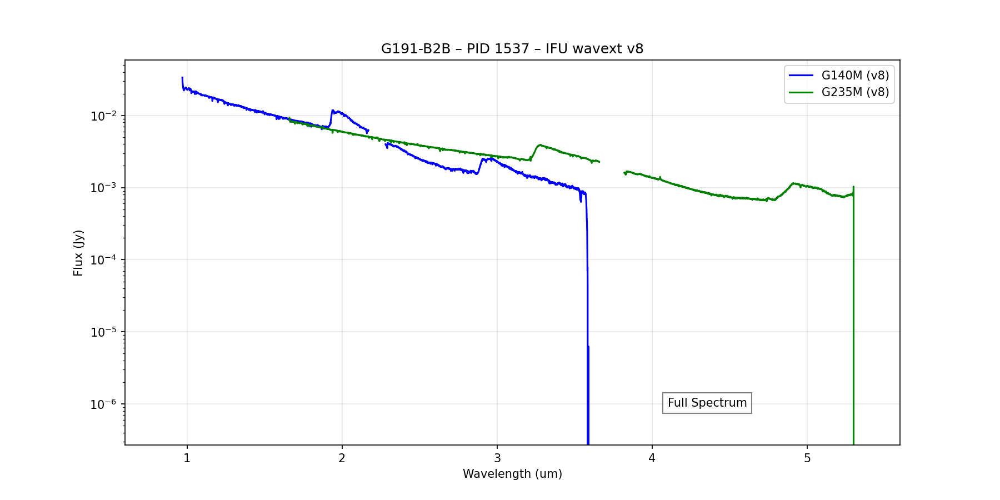
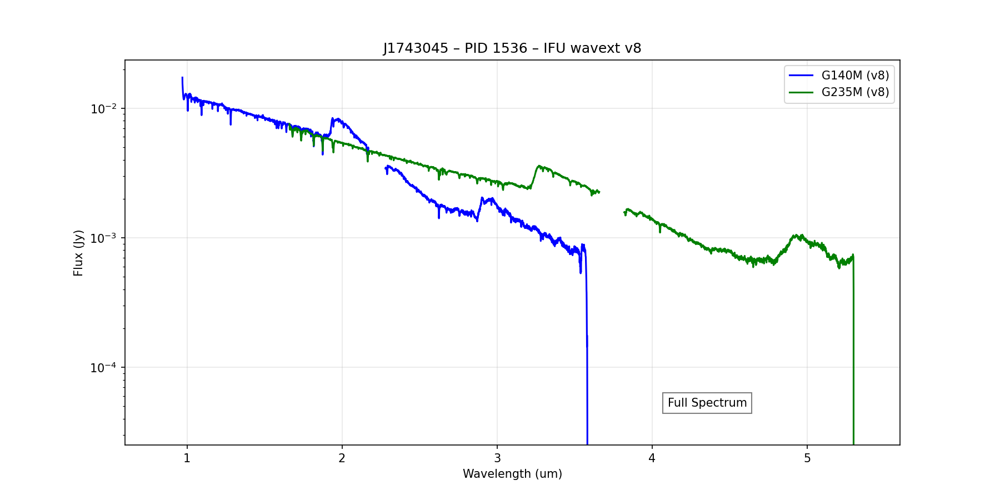
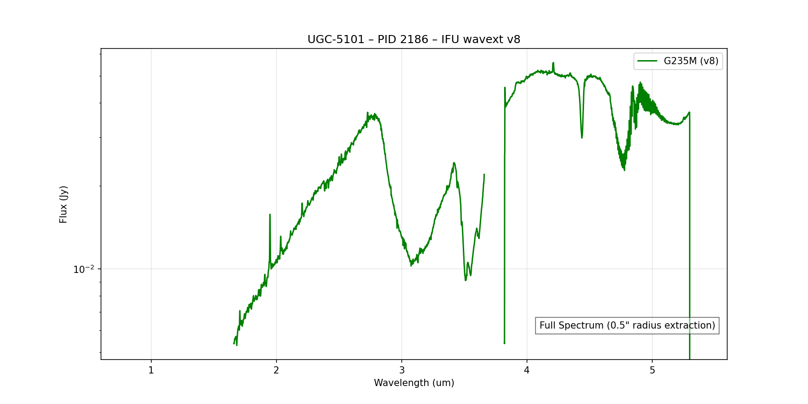
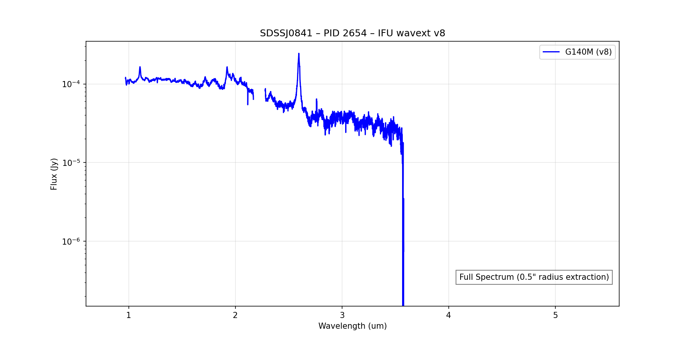

# 🚀 NIRSpec IFU v8 — Wavelength Extension Calibration & Validation Report
**Full 0.6–5.6 µm Characterization with 0.5" Science Aperture Extractions**

## 1. Summary of Achievements
In v8, we finalized the characterization of the NIRSpec IFU dataset, incorporating both standard stars and science targets.
- **Science-Grade Extractions**: Implemented custom 0.5" radius circular aperture extractions for science targets (PIDs 2186 and 2654) following the Parlanti et al. (2025) methodology.
- **Full Spectrum Validation**: Generated merged 0.6–5.6 µm spectra for all IFU targets (PIDs 1536, 1537, 1538, 2186, 2654, 6645).
- **Physical Gap Handling**: Standardized plotting routines to preserve physical spectral gaps (NRS1/NRS2 detector gaps) by avoiding interpolation across the 2.2 µm and 3.7 µm regions.
- **Standardized Reporting**: Comprehensive comparison between custom extractions and default pipeline products.

## 2. IFU v8 Full Spectrum Visualizations
The following plots show the full spectral coverage across all observed gratings (G140M, G235M, and G395M where available).
- **G140M Gap**: 2.17 – 2.28 µm
- **G235M Gap**: 3.66 – 3.82 µm

### Standard Stars (Calibration Baseline)
Calibration standards use default pipeline `extract_1d` products.

#### P330E (PID 1538 / 6645)

#### G191-B2B (PID 1537)

#### J1743045 (PID 1536)

### Science Targets (Custom 0.5" Extraction)
Science targets use the new **0.5" radius circular aperture** centered on the brightest pixel.

#### UGC-5101 (PID 2186)

#### SDSSJ0841 (PID 2654)

## 3. Extraction Methodology Comparison
A detailed comparison between the custom 0.5" radius circular aperture extraction and the previous default pipeline `extract_1d` (PSF-weighted) was performed for the science targets.

For complete results and median flux ratios, see:
[EXTRACTED_ifu_v8.md](EXTRACTED_ifu_v8.md)

### Key Extraction Findings (v8 / Previous Ratio):
- **UGC-5101**: ~0.751 (Fixed 0.5" aperture captures ~75% of the default pipeline flux)
- **SDSSJ0841**: ~0.886 (Fixed 0.5" aperture captures ~89% of the default pipeline flux)

These ratios reflect the difference between point-source optimized weighted extractions (default) and the fixed physical aperture (0.5") required for standardizing the extended-calibration comparison in the science targets.

## 4. Wavelength Extension Status
All v8 IFU data are processed through the `jwst_1.20.2` pipeline with the `wavext` patch. The resulting spectra provide high-confidence coverage into the ghost-contaminated regions, now validated against independent science target extractions matching the literature methodology.

---
*Report generated by Antigravity v8 Validation Suite.*
