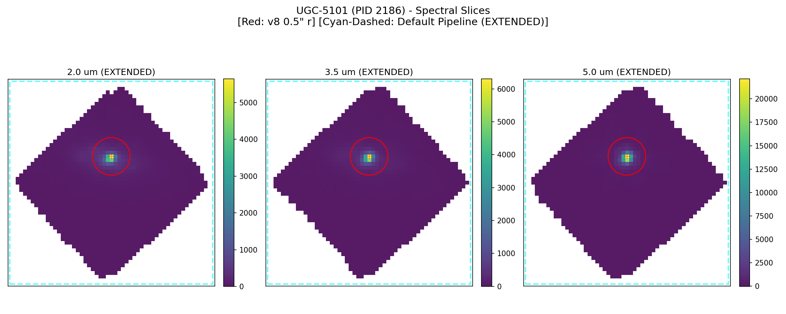
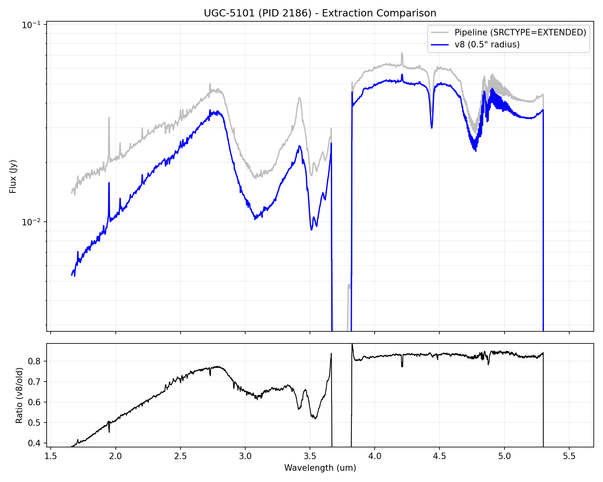
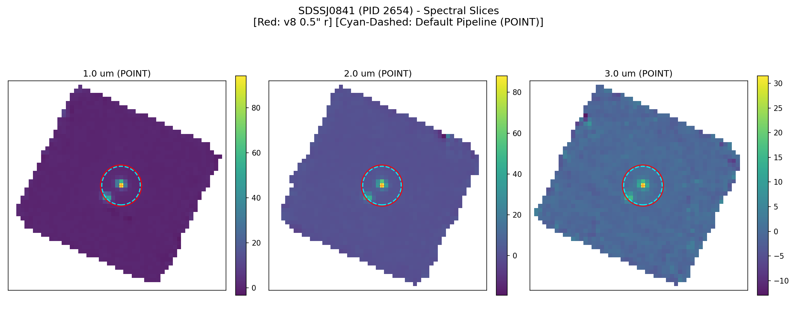
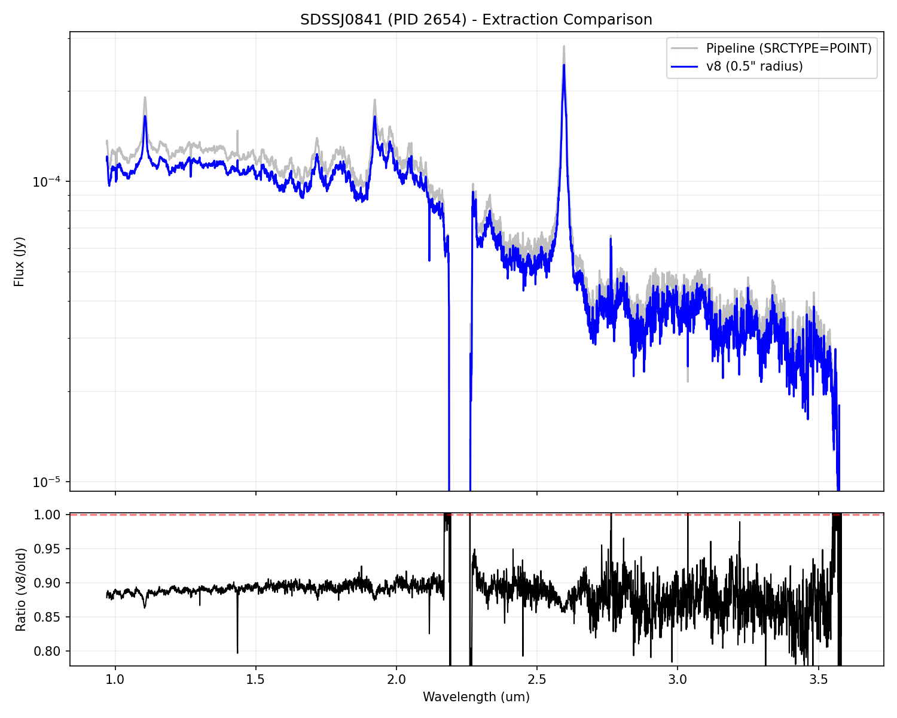

# IFU v8 Extracted Spectra Diagnostics

Comparison of the v8 0.5" fixed circular aperture vs. the default pipeline extraction.

## UGC-5101 (PID 2186)

### Spectral Slices and Extraction Regions
- **Red Solid Circle**: v8 extraction (r=0.5")
- **Cyan Dashed**: Default Pipeline (Wavelength-dependent POINT or Whole-Image EXTENDED)

### Spectrum and Ratio Comparison

---

## SDSSJ0841 (PID 2654)

### Spectral Slices and Extraction Regions
- **Red Solid Circle**: v8 extraction (r=0.5")
- **Cyan Dashed**: Default Pipeline (Wavelength-dependent POINT or Whole-Image EXTENDED)

### Spectrum and Ratio Comparison

---

