# Total IFU Extraction Baseline Comparison

Comparison of 4 extraction methods across all v8 catalog datasets:
1. **extract1d**: Official pipeline output (includes aperture correction for POINT).
2. **v8 (r=0.5")**: Project custom fixed circular aperture, **centered on brightest pixel**, no background subtraction.
3. **r=0.45"**: Reference fixed aperture, **centered on nominal pointing**, with background annulus subtraction (1.0-1.2") if SRCTYPE=POINT.
4. **Entire FOV**: Summation of the entire spatial footprint of the cube.

## Summary Statistics

| PID | Name | SRCTYPE | median Flux v8 (Jy) | median Ratio (v8/x1d) |
| :--- | :--- | :--- | :--- | :--- |
| 1536 | J1743045 | POINT | 0.005655 | 1.005 |
| 1537 | G191-B2B | POINT | 0.006409 | 1.005 |
| 1538 | P330E | POINT | 0.020933 | 1.010 |
| 2186 | UGC-5101 | EXTENDED | 0.010100 | 0.496 |
| 2654 | SDSSJ0841 | POINT | 0.000108 | 0.892 |
| 6645 | P330E-C3 | POINT | 0.020602 | 139.464 |

## J1743045 (PID 1536)

### Spectra
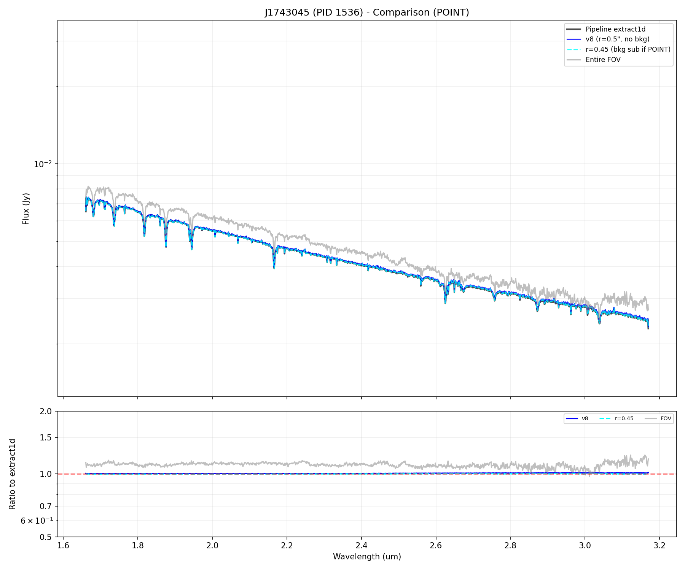

### Slices & Apertures
**Red Solid**: v8 (peak-centered, 0.5") | **Cyan Dashed**: Pipeline (pointing-centered, 0.45")

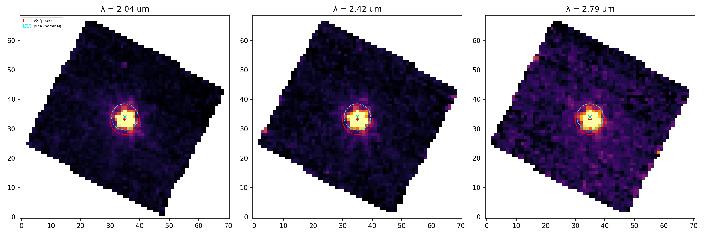

---

## G191-B2B (PID 1537)

### Spectra
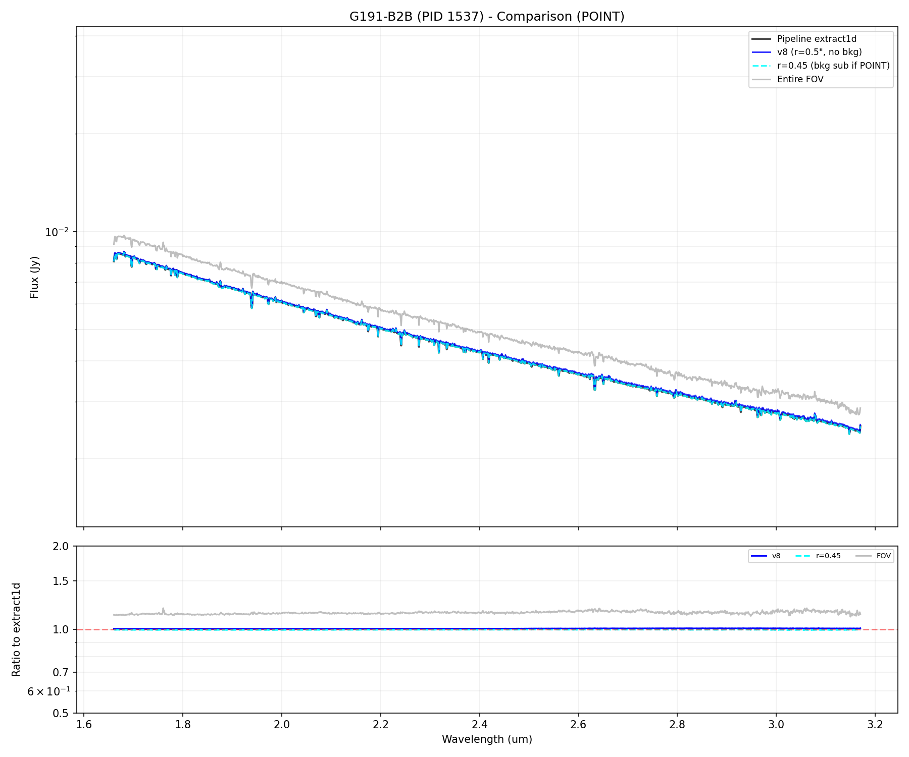

### Slices & Apertures
**Red Solid**: v8 (peak-centered, 0.5") | **Cyan Dashed**: Pipeline (pointing-centered, 0.45")

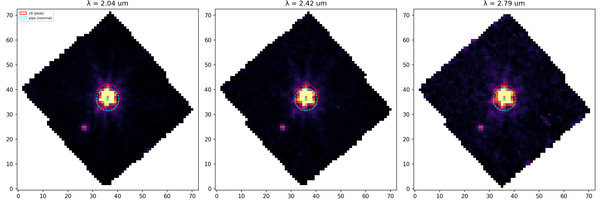

---

## P330E (PID 1538)

### Spectra
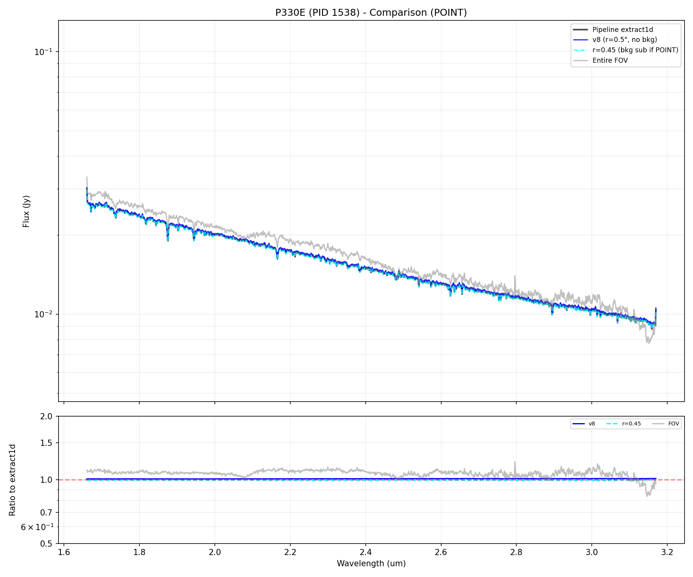

### Slices & Apertures
**Red Solid**: v8 (peak-centered, 0.5") | **Cyan Dashed**: Pipeline (pointing-centered, 0.45")

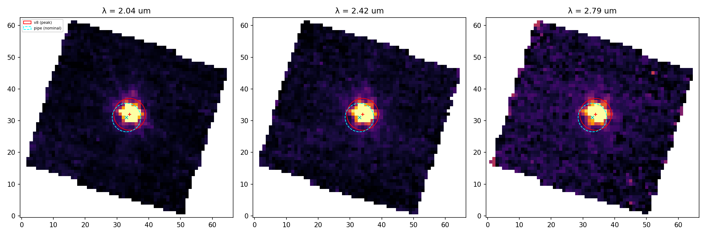

---

## UGC-5101 (PID 2186)

### Spectra
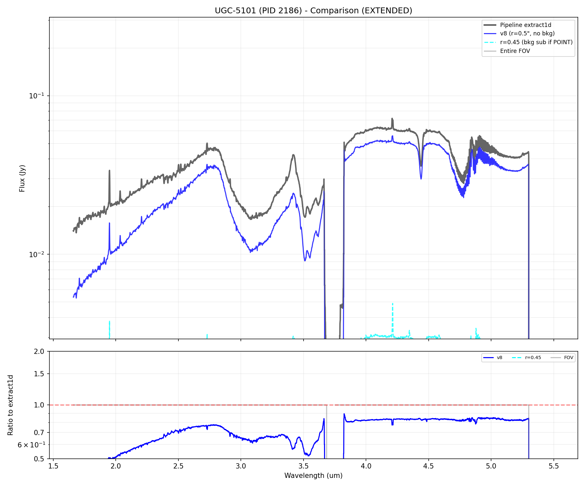

### Slices & Apertures
**Red Solid**: v8 (peak-centered, 0.5") | **Cyan Dashed**: Pipeline (pointing-centered, 0.45")

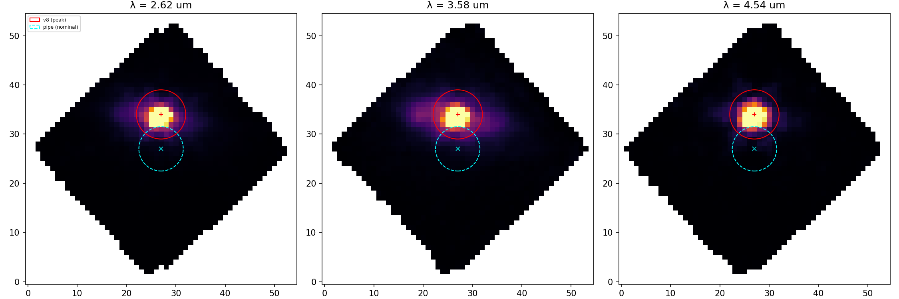

---

## SDSSJ0841 (PID 2654)

### Spectra
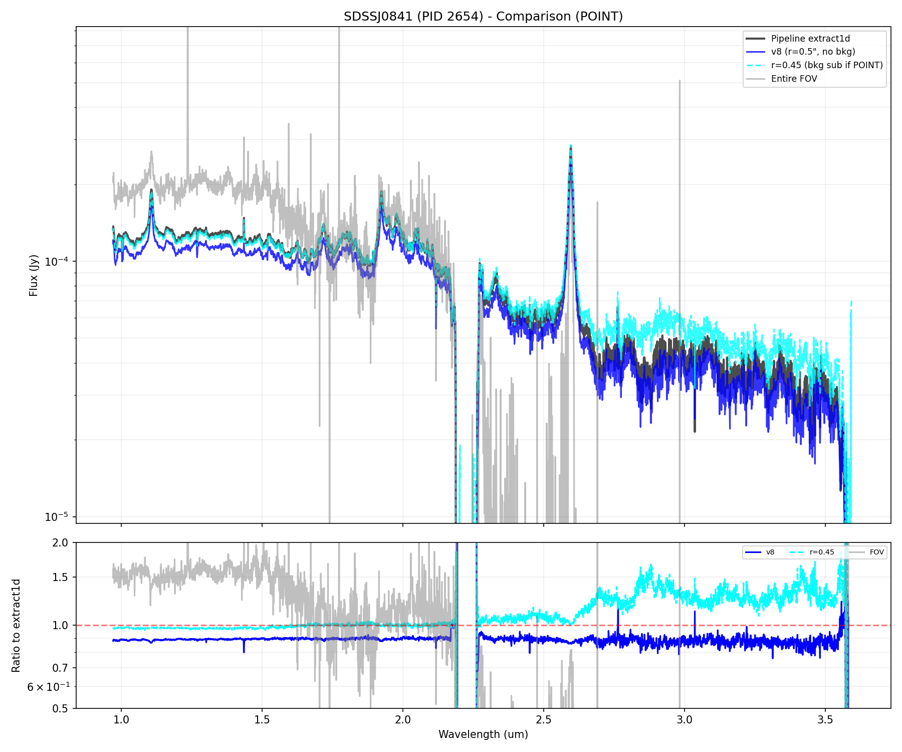

### Slices & Apertures
**Red Solid**: v8 (peak-centered, 0.5") | **Cyan Dashed**: Pipeline (pointing-centered, 0.45")

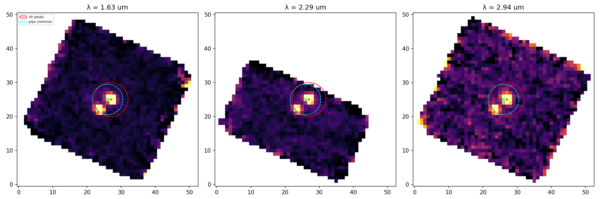

---

## P330E-C3 (PID 6645)

### Spectra
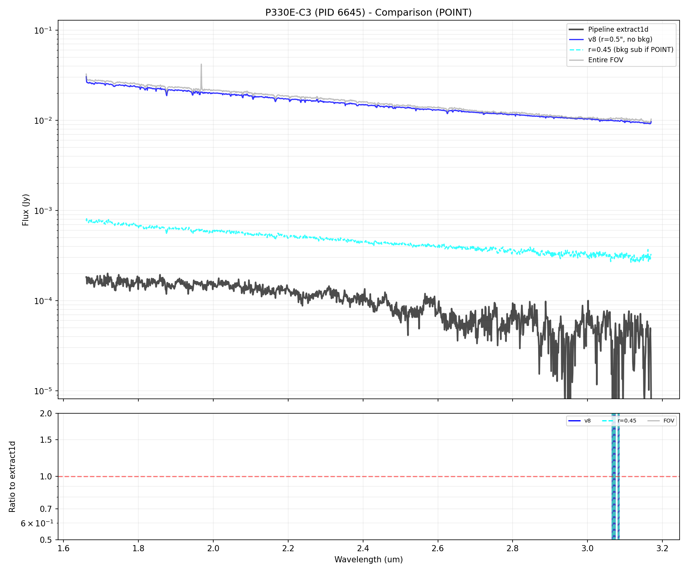

### Slices & Apertures
**Red Solid**: v8 (peak-centered, 0.5") | **Cyan Dashed**: Pipeline (pointing-centered, 0.45")

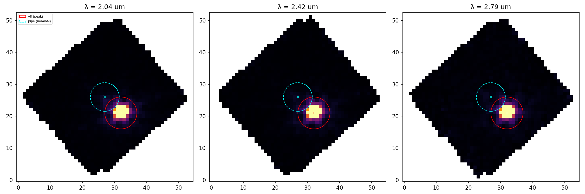

---

