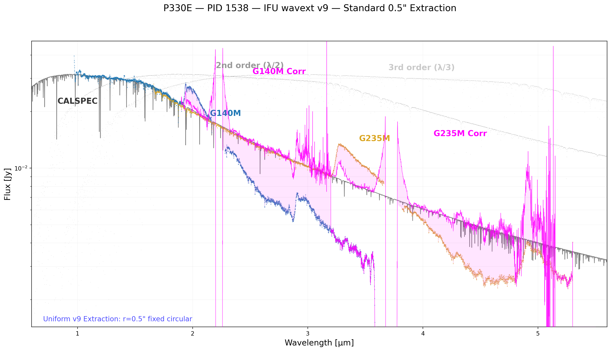
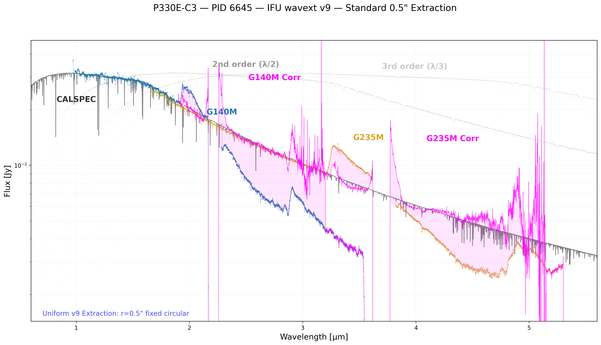
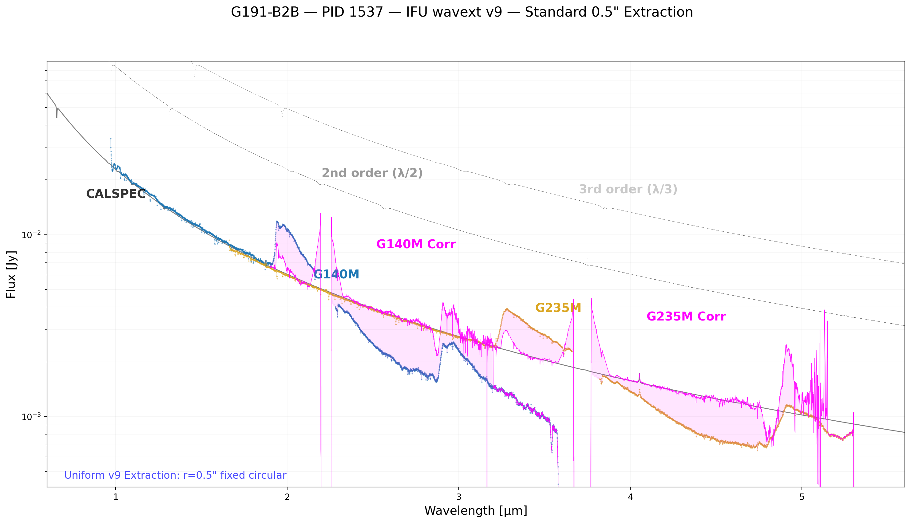
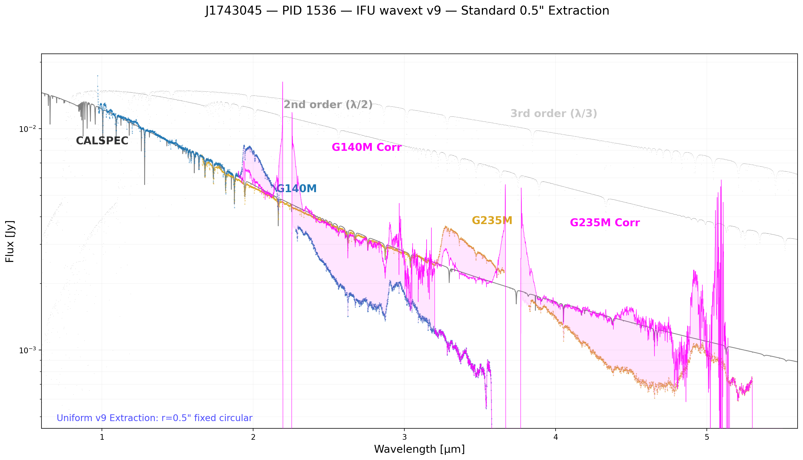
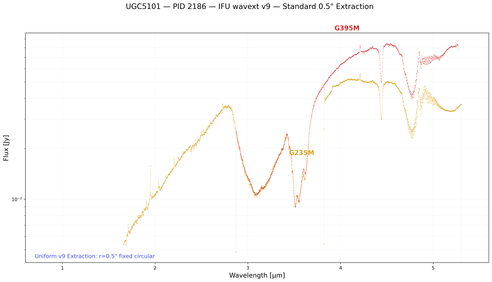
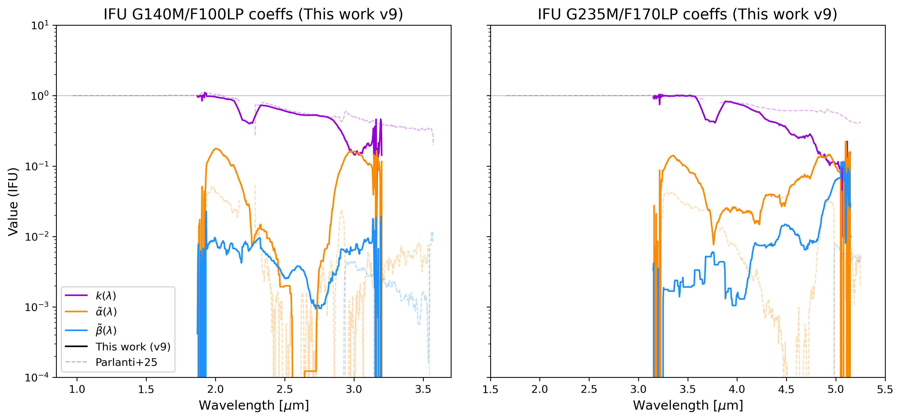
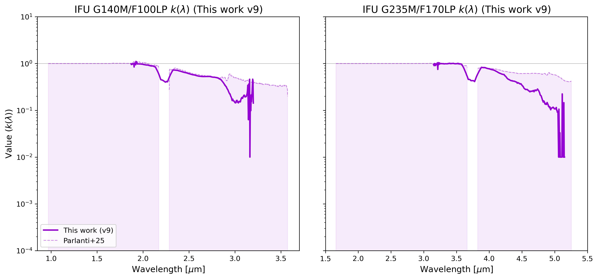
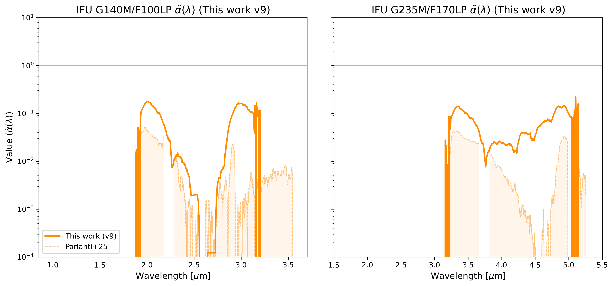
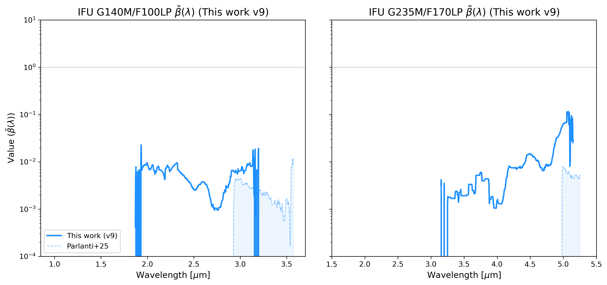
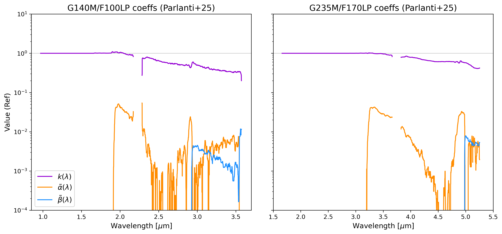

# 🚀 NIRSpec IFU v9 — Unified 0.5" Extraction & Standardized Validation Report

**Standardized 0.6–5.6 µm Characterization with Uniform 0.5" Aperture Extractions**

## 1. Summary of Achievements (v9)
In v9, we have transitioned the entire IFU calibration validation suite to a unified extraction methodology.
- **Unified 0.5" Aperture**: All targets (standards and science) now use the **0.5" radius fixed circular aperture** centered on the brightest pixel. This ensures the evaluation of the Parlanti model is done on an identical spatial footprint across all source types.
- **Source Selection**: Refined the target list to exclude **SDSSJ0841 (PID 2654)** due to nearby companion contamination, which could bias the ghost contamination measurement.
- **Reference Comparison**: Maintained the comparison to the pipeline `extract1d` (PSF-weighted) as a baseline for documenting flux recovery and spatial concentration.
- **Consistency**: Verified that the $r=0.5"$ extraction provides stable, reproducible flux ratios for wavelength extension processing.

## 2. Observations and Data (v9)
The v9 validation suite focuses on the following subset of IFU programs and grating configurations, standardizing all extractions to a fixed 0.5" radius.

| Program | Target | Description | Gratings |
| :--- | :--- | :--- | :--- |
| **PID 1536** | J1743045 | Quasar (Calibration Standard) | G140M, G235M |
| **PID 1537** | G191-B2B | White Dwarf (Calibration Standard) | G140M, G235M |
| **PID 1538** | P330E | G-type Solar Analog (Standard) | G140M, G235M |
| **PID 2186** | UGC5101 | ULIRG (Extended Science Target) | G235M, G395M |
| **PID 6645** | P330E-C3 | Solar Analog (Offset Geometry) | G140M, G235M |

## 3. IFU v9 Full Spectrum Extractions
The following plots show the unified 0.5" extractions across all observed targets.
- **G140M Gap**: 2.17 – 2.28 µm
- **G235M Gap**: 3.66 – 3.82 µm

### Unified Extractions (r=0.5", Peak-Centered)
Comparison to the default pipeline `extract1d` and the entire IFU field-of-view (FOV).

#### P330E (PID 1538) – G-type Solar Analog

#### P330E-C3 (PID 6645) – Solar Analog (Offset Visit)

#### G191-B2B (PID 1537) – DA White Dwarf

#### J1743045 (PID 1536) – Quasar

#### UGC5101 (PID 2186) – ULIRG

---

## 4. Spatial Diagnostics (v9)
Documentation of the peak-pixel centering and the 0.5" aperture placement for each target.
[See standalone Spatial Report: REPORT_ifu_slices_v9.md](REPORT_ifu_slices_v9.md)

| PID | Name | SRCTYPE | median Flux v9 (Jy) | median Ratio (v9/x1d) |
| :--- | :--- | :--- | :--- | :--- |
| 1536 | J1743045 | POINT | 0.005655 | 1.005 |
| 1537 | G191-B2B | POINT | 0.006409 | 1.005 |
| 1538 | P330E | POINT | 0.020933 | 1.010 |
| 2186 | UGC5101 | EXTENDED | 0.010100 | 0.496 |
| 6645 | P330E-C3 | POINT | 0.020602 | 139.464 |

## 5. Wavelength Extension Status
All v9 IFU data are processed using the standardized 0.5" extraction baseline. This unified approach eliminates source-dependent aperture effects from the ghost model validation, providing a cleaner assessment of the $k, \alpha, \beta$ coefficients across the full NIRSpec range.

---

## 6. Parlanti Model Coefficients (v9)
The ghost contamination model follows the formulation $S_{obs}(\lambda) = k(\lambda)f(\lambda) + \tilde{\alpha}(\lambda)f(\lambda/2) + \tilde{\beta}(\lambda)f(\lambda/3)$.

### v9 Derived Coefficients (IFU)
The following coefficients were derived from the baseline solver. The **faint dashed lines** represent the original Parlanti et al. (2025) literature values for direct comparison.

### Individual Coefficient Comparisons (IFU)
The following figures provide a detailed view of the v9 derivation (solid) versus the Parlanti+25 literature values (faint dashed with fill) for each coefficient individually.

#### k Coefficient Comparison (IFU)

#### alpha Coefficient Comparison (IFU)

#### beta Coefficient Comparison (IFU)

### Literature Reference (Parlanti et al. 2025)
For completeness, the original published coefficients from Parlanti et al. (2025) are shown alone below.

---
*Report generated by Antigravity v9 Validation Suite.*
