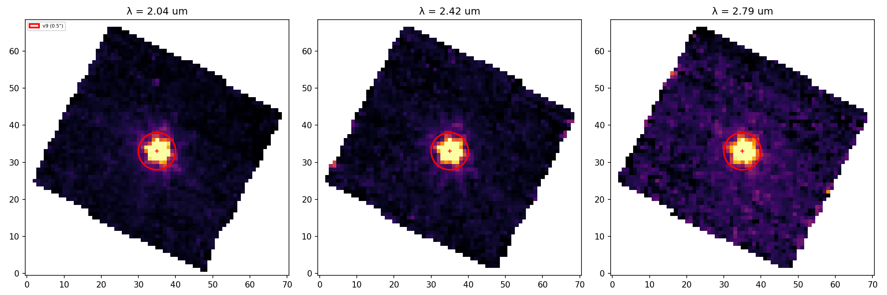
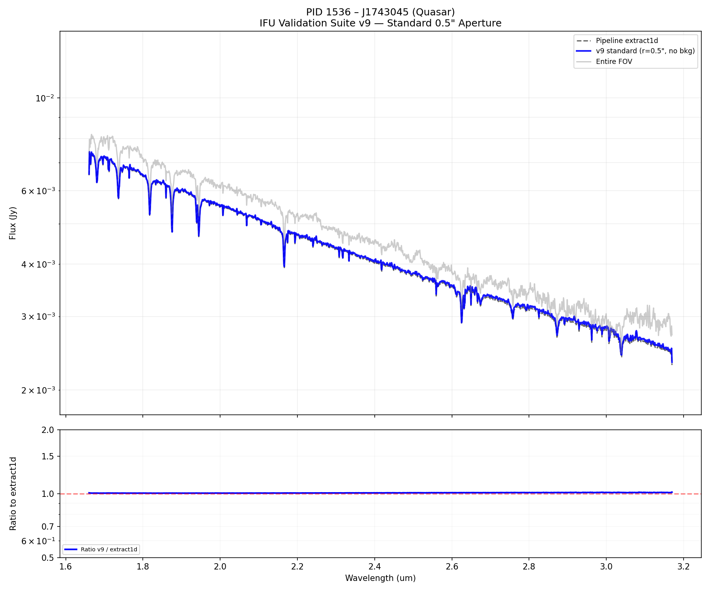
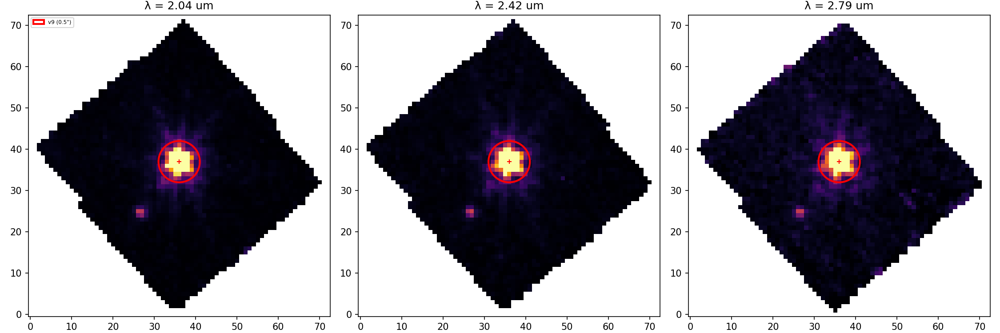
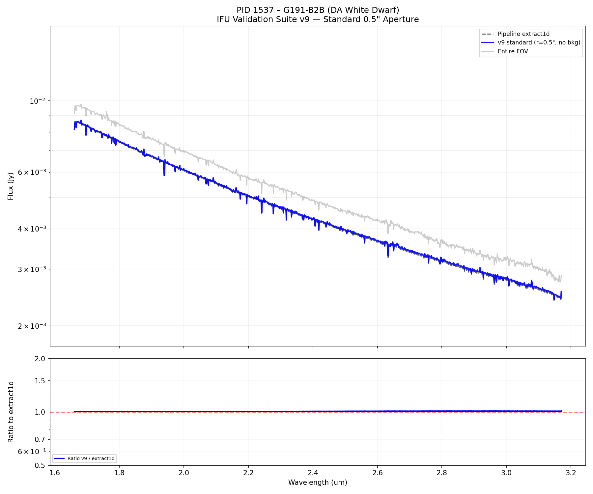
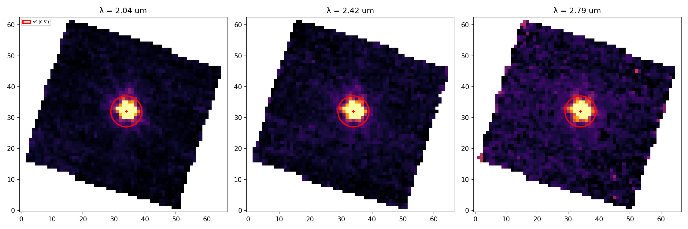
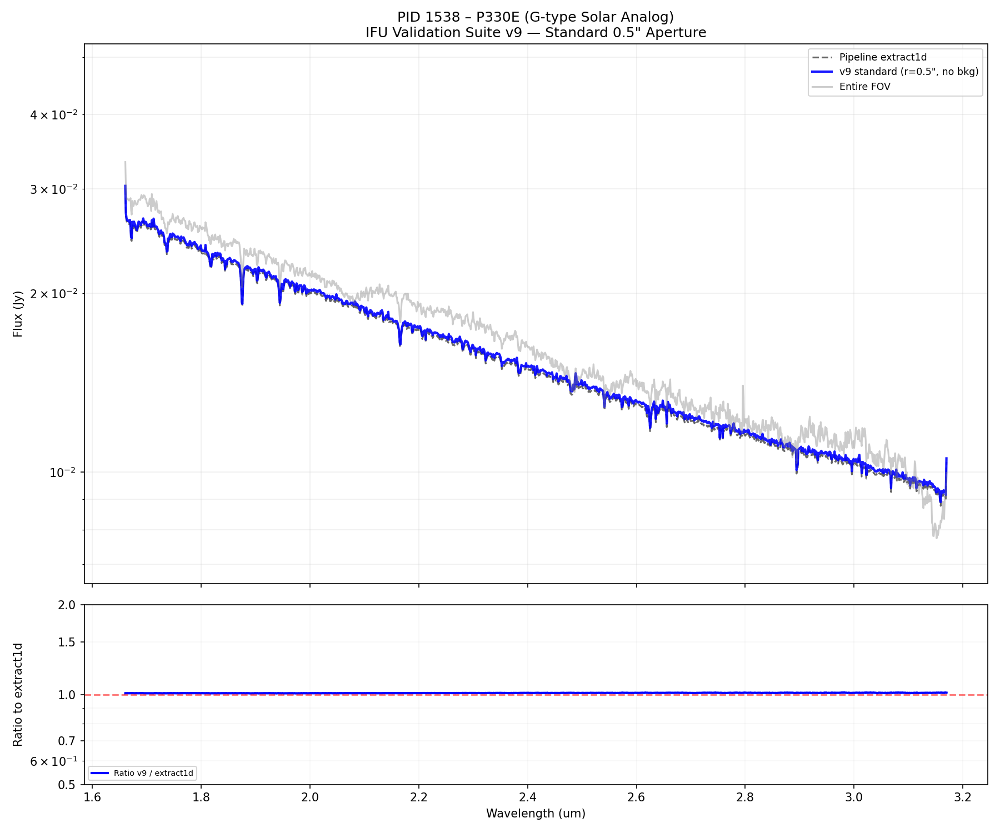
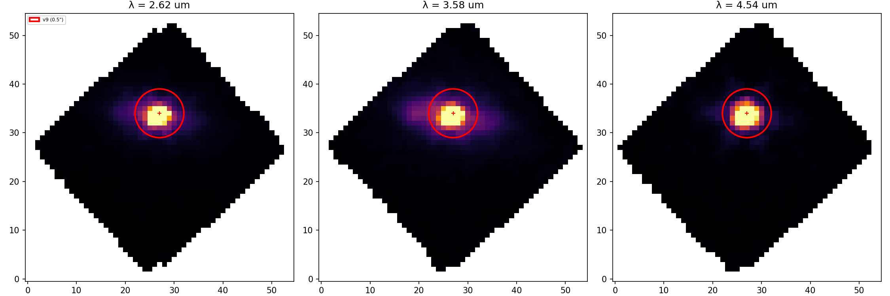
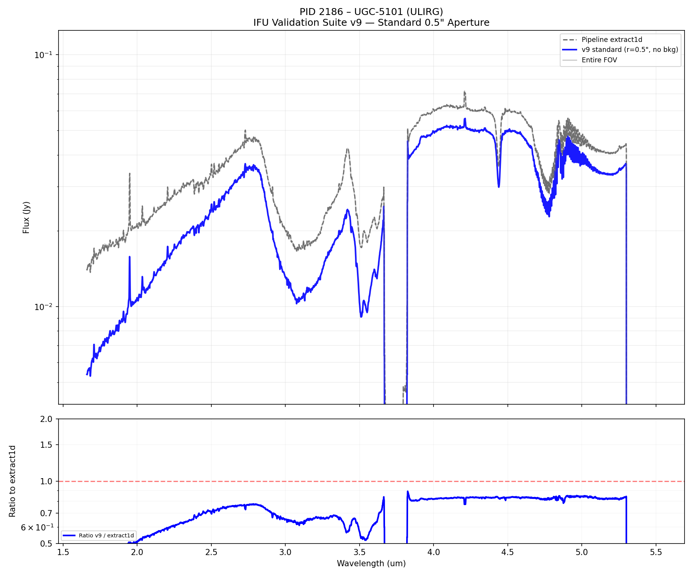
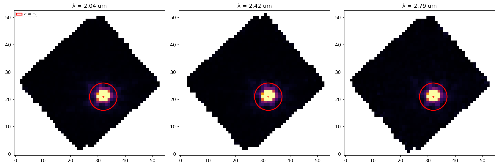
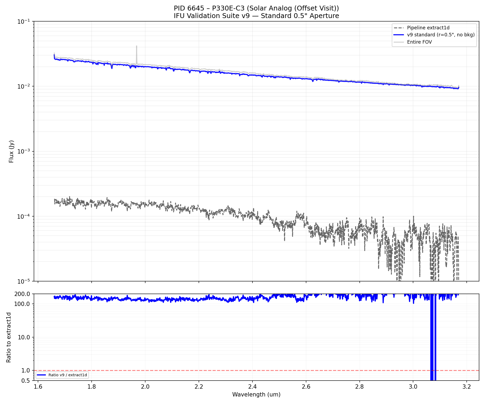

# Total IFU Extraction Baseline Comparison — v9 (Uniform 0.5")

In v9, all extractions are standardized to a 0.5" fixed-radius aperture centered on the brightest pixel.

## Summary Statistics

| PID | Name | SRCTYPE | median Flux v9 (Jy) | median Ratio (v9/x1d) |
| :--- | :--- | :--- | :--- | :--- |
| 1536 | J1743045 | POINT | 0.005655 | 1.005 |
| 1537 | G191-B2B | POINT | 0.006409 | 1.005 |
| 1538 | P330E | POINT | 0.020933 | 1.010 |
| 2186 | UGC-5101 | EXTENDED | 0.010100 | 0.496 |
| 6645 | P330E-C3 | POINT | 0.020602 | 139.464 |

## PID 1536 – J1743045 (Quasar)

### Slices & Apertures
**Red Solid**: v9 extraction footprint (peak-centered, 0.5")

### Spectra

---

## PID 1537 – G191-B2B (DA White Dwarf)

### Slices & Apertures
**Red Solid**: v9 extraction footprint (peak-centered, 0.5")

### Spectra

---

## PID 1538 – P330E (G-type Solar Analog)

### Slices & Apertures
**Red Solid**: v9 extraction footprint (peak-centered, 0.5")

### Spectra

---

## PID 2186 – UGC-5101 (ULIRG)

### Slices & Apertures
**Red Solid**: v9 extraction footprint (peak-centered, 0.5")

### Spectra

---

## PID 6645 – P330E-C3 (Solar Analog (Offset Visit))

### Slices & Apertures
**Red Solid**: v9 extraction footprint (peak-centered, 0.5")

### Spectra

---

